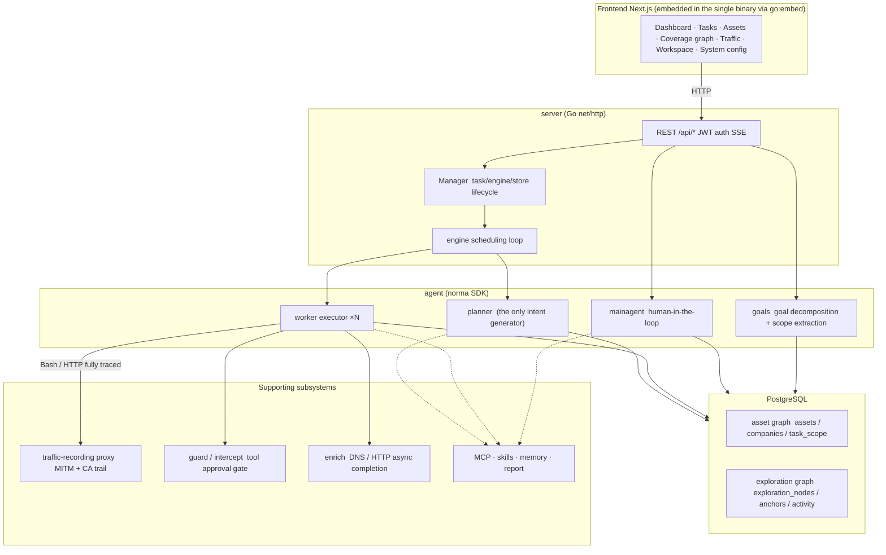
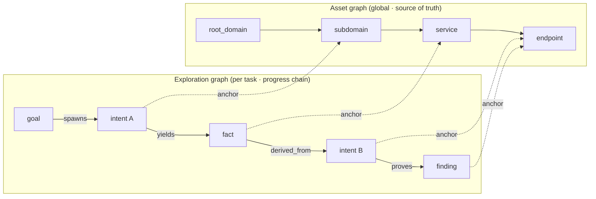
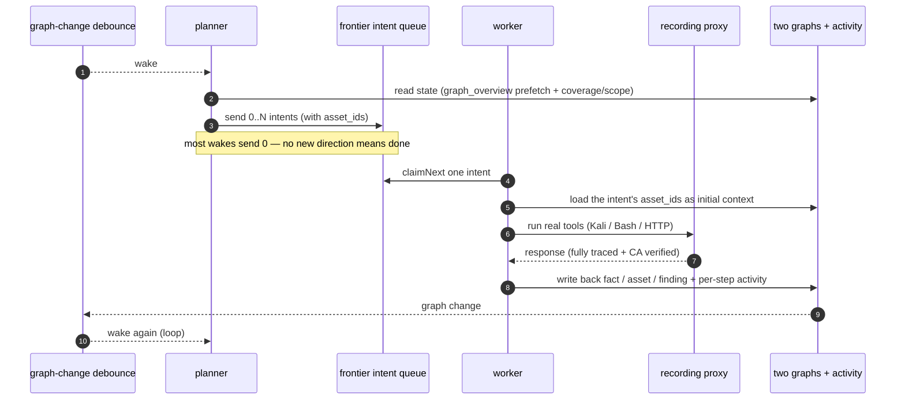
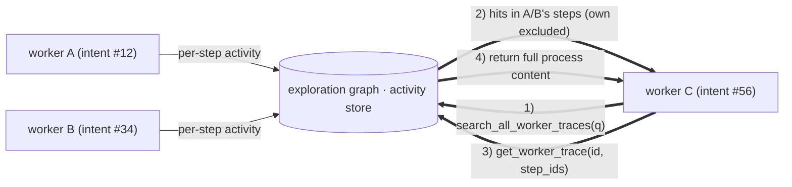
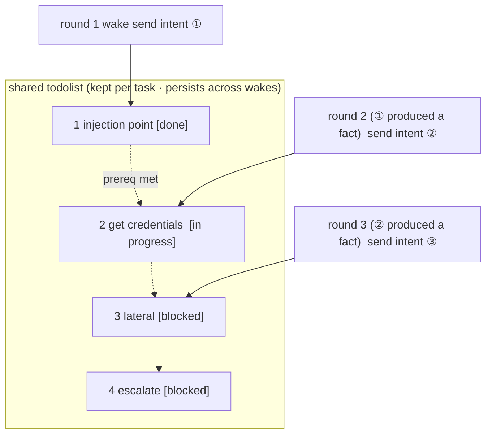

<div align="center">

# ARTIFEX

An LLM multi-agent autonomous penetration-testing system (Go backend + Next.js frontend)

English

</div>

---

> **About this project.** ARTIFEX — an LLM multi-agent autonomous penetration-testing system by
> [Autumn-27](https://github.com/Autumn-27/ARTEX) (Baidu "Agent+" attack-defense challenge champion
> project). Built from upstream commit `160fe13`; this tree rebrands the product as **ARTIFEX**
> with attribution retained.

[Verification status and known limitations](docs/VERIFICATION.md).

> The code and architecture originate in ARTEX. This tree rebrands the product as ARTIFEX
> across the interface, documentation, and distribution targets. See [License and disclaimer](#license-and-disclaimer)
> for the terms (AGPL-3.0).
>
> **Authorization.** This is a security-testing tool. Use it only against systems you own or are
> explicitly authorized to test. The upstream usage restrictions still apply — read them below.

---

## Language

English is the only interface language. The server's durable default is
`language` in system settings; `ARTIFEX_LANGUAGE` supplies the environment fallback. Operating-system
`LANG` does not select the application language.

Requests prefer `lang`, then supported `Accept-Language` preferences, then the `artifex_locale`
cookie, then the server default. New HTTP-created tasks retain their language across queues and
restarts; older tasks without saved language use the server default. Built-in agent guidance and
output instructions use the run language; user-edited templates and stored evidence remain intact.
Report/CSV/ZIP labels use the export request's language. [Full documentation](docs/README.md)
includes the bundled skill guidance.

## Screenshots

Captures from the original upstream ARTEX (Chinese interface); the English build follows the same
layout. They show the bundled demo data, not scans of live targets.

| Dashboard | Tasks |
| :---: | :---: |
|  |  |
| Findings | LLM |
|  |  |

---

## Approval records

The global "Approval records" view, the in-task "Interception approval" panel, and the approval
cards shown inside conversations all expand to show full detail. The presentation follows the
[approval-detail component from AegisHook](https://github.com/RuoJi6/AegisHook/blob/main/web/src/components/CallDetail.vue),
reusing the upstream component and theme.

## Asset sync (ScopeSentry)

You can sync asset data directly from [ScopeSentry](https://github.com/Autumn-27/ScopeSentry),
which saves you from collecting the same data twice:

- On the **Asset sync** page, enter your ScopeSentry address and API key to connect the data source.
- Choose what to sync by **project** or by **task**, and pick the asset types (domain / subdomain /
  IP / port / site / endpoint …).
- Import in one click. Assets are merged into the company asset scope and go straight into the
  asset graph for agents to explore.

---

## Installation

### GLM and other model providers

The **LLM → New** form includes GLM-5.3 configuration templates for Z.ai's General API and a
separately labeled Coding Plan reference. Add your own API key; template selection does not save,
activate, or contact a provider. Coding Plan use is restricted to officially supported tools, and
ARTIFEX is not listed. See [provider setup and support limits](docs/llm-providers.md).

> Requires a **PostgreSQL** database. Exploration needs an **LLM** configured
> (`ANTHROPIC_API_KEY` or `OPENAI_API_KEY`, or set it in the UI).

### Option 1: one-click install script (recommended)

```bash
git clone https://github.com/sebastian93921/ARTIFEX.git
cd artifex
./install.sh
```

The script detects (and optionally installs) Docker, then lets you choose **① all-in-Docker** or
**② build and run locally**:

- **① All-in-Docker**: enter one Postgres password (press Enter for a random one) → it writes
  `.env` → `docker compose up -d`.
- **② Local**: pick a database (connect to an existing one, or start one with Docker) → it
  generates `config.json` → `go` compiles a single binary with the frontend embedded → start.

Once it is up, open **http://localhost:8787** (the first visit lands on `/setup` to set the admin
password).

> The scripts speak English by default.

### Option 2: Docker Compose (manual)

```bash
git clone https://github.com/sebastian93921/ARTIFEX.git
cd artifex
cp .env.example .env          # set POSTGRES_PASSWORD, optionally ANTHROPIC_API_KEY
docker compose up -d --build  # builds the artifex image locally + postgres
# → http://localhost:8787
```

> The default compose file **builds the image locally** from this source. To use a published
> release image from `ghcr.io/autumn-27/artifex`, explicitly select its version in compose.

The image bundles common tools (ripgrep/curl/vim/npm/nmap…); `./skills` and `./data` are
bind-mounted so they persist.

A remote MCP can use `http` (Streamable HTTP) or `sse` (legacy SSE) in system settings. Legacy SSE
servers usually open the event stream with `GET /sse` and then receive JSON-RPC requests on the
`/message?sessionId=...` the server returns; set the URL to `/sse` and the header to
`Authorization=Bearer <token>`.

### Option 3: download a prebuilt binary (Releases)

> Download a platform archive from [Releases](https://github.com/sebastian93921/ARTIFEX/releases).
> The archive for each platform is
> `artifex-<version>-<os>-<arch>.zip`, unpacking to `artifex` + `start.sh`
> (`start.bat` on Windows) + `skills/` + `config.example.json`:

The archive also includes `adapters/agent/`; see the [agent setup instructions](adapters/agent/README.md).

```bash
cp config.example.json config.json   # fill in the database connection
./start.sh                            # → http://localhost:8787
```

> Start with `start.sh` / `start.bat`, not `./artifex` directly. It is a supervisor: after the
> program exits it decides, from the exit code, whether to relaunch, and the
> [in-app one-click update](#option-1-in-app-one-click-update-recommended) relies on it to swap in
> the new build. Running `./artifex` directly means an update will not be relaunched.
> To run in the background: `nohup ./start.sh >artifex.log 2>&1 &`.

### Option 4: build a single binary from source

```bash
# 1) export the frontend as static files
cd web && npm ci && npm run build:static && cd ..
# 2) copy it into the embed directory
mkdir -p server/webui/dist
cp -R web/out/. server/webui/dist/
# 3) build (the embedui tag embeds the frontend)
CGO_ENABLED=0 go build -tags embedui -o artifex ./cmd/artifex
./start.sh
```

> The build source path stays `./cmd/artifex` and the Go module stays `github.com/sebastian93921/artifex`
> for compatibility with upstream. Only the output binary is named `artifex`.

### Option 5: build cross-platform release archives

`build.sh` builds and embeds the frontend, strips debug info with the Go linker, and zips each
release. Release mode builds Linux amd64/arm64, macOS amd64/arm64, and Windows amd64 by default:

```bash
./build.sh --release
# output: dist/artifex-0.3.3-*.zip
```

UPX-packed self-extracting binaries can clash with some Linux kernels, virtualization, or security
policies, so UPX is off by default. Set custom targets with `ARTIFEX_TARGETS`, and pass `--upx` explicitly when you have confirmed the target is compatible:

```bash
ARTIFEX_TARGETS=linux/amd64,windows/amd64 ./build.sh --release
./build.sh --target linux/amd64 --upx
```

---

## Updating

> Updates swap the program only; your data stays put. The Postgres volume `pgdata`, `./data`
> (jwt.key / SQLite / …), and `./skills` are all preserved. **Database migrations run on their
> own** — `artifex` re-runs `schema.sql` idempotently on every start (including `ADD COLUMN` /
> `CREATE INDEX IF NOT EXISTS`), so "restart is migrate." Still, back up `./data` and the database
> before upgrading.

### Option 1: in-app one-click update (recommended)

On the **System configuration** page (sidebar "System configuration" → `/system/settings`), the
**Version and updates** card checks for and installs new versions without logging into the server.

After you click "Update": it downloads the release for your platform → checks it against the
release's `SHA256SUMS` → smoke-tests the new binary with `-h` → stages it as `artifex.new` →
the program exits and `start.sh` / `start.bat` relaunches it to finish the swap. The page waits for
the new version to come up and refreshes.

- **A failed update leaves no broken program**: if verification or the smoke test fails, the staged
  file is discarded and the current version keeps running. If a swapped-in version fails to start
  three times in a row, it rolls back to `artifex.old` automatically (the failed one is kept as
  `artifex.failed` for inspection).
- **Roll back anytime**: the previous version is kept as `artifex.old`, and the card has a
  "Roll back to previous version" button. Note that the database schema does not roll back.
- **Updating interrupts running tasks** — an update is a restart, so do it when idle.
- **Development builds get no updates**: this is disabled when the version is `dev` or a
  `git describe` string with a suffix, so a release does not overwrite a locally built debug binary.
- **Under Docker, only the program changes, not the image**: the playwright / nmap toolchains in the
  image do not upgrade along with it, and rebuilding the container with `docker compose up -d` reverts
  to the versions baked into the image. To upgrade the image too, use
  `docker compose pull artifex && docker compose up -d artifex` (once a published image exists;
  otherwise `docker compose up -d --build artifex`).
- If reaching GitHub needs a proxy, configure the **global proxy** on the same page and the update
  path uses it. Updates download only from GitHub domains and force HTTPS.

### Option 2: one-click update script

```bash
cd artifex
./update.sh
```

The script optionally runs `git pull` first, then lets you choose **① Docker update** or
**② local build update** (matching `install.sh`):

- **① Docker**: rebuild the current checkout with `docker compose build artifex`, then
  recreate the service with `docker compose up -d artifex`.
- **② Local**: rebuild the frontend static output → recompile `./artifex` (restart the process
  to apply).

### Option 3: Docker Compose (manual)

```bash
cd artifex
git pull                       # update compose / scripts (optional)
# To pin a source version, check out a reviewed tag or commit before building.
docker compose up -d --build artifex   # rebuild from source and restart → auto-migrate schema
docker image prune -f          # clean up old images (optional)
```

> Once a published image exists and compose explicitly selects it, replace the build step with
> `docker compose pull artifex && docker compose up -d artifex`.

### Option 4: prebuilt binary (Releases)

Download the new `artifex-<version>-<os>-<arch>.zip`, stop the old process,
overwrite `artifex` and `skills/` (keep your `config.json` and `data/`), and restart:

```bash
cp -r <unpacked>/skills ./ && cp <unpacked>/artifex ./
./start.sh
```

### Option 5: build from source

```bash
git pull
cd web && npm ci && npm run build:static && cd ..
cp -r web/out server/webui/dist
CGO_ENABLED=0 go build -tags embedui -o artifex ./cmd/artifex
# restart ./start.sh
```

---

## Configuration

### Coding-agent integration

Claude Code, Codex and Pi can create tasks, read progress, coverage and findings through the
[agent adapter](adapters/agent/README.md). Claude Code/Codex use local stdio MCP; Pi uses a native
extension. Reads are enabled by default, with task creation and pause/resume explicitly enabled
through configuration. The adapter uses the existing authenticated API and keeps ARTIFEX's
internal agents and model configuration intact.

**Database** (`config.json`, or override with the environment variable `ARTIFEX_PG_DSN`):

```json
{
  "database": {
    "host": "127.0.0.1", "port": 5432,
    "user": "artifex", "password": "yourpass",
    "dbname": "artifex", "sslmode": "disable"
  }
}
```

> The configuration and environment keys keep the `ARTIFEX_*` prefix and the `artifex` database defaults
> for compatibility with upstream. Scripts also accept the `ARTIFEX_*` aliases where noted.

**LLM**: `export ANTHROPIC_API_KEY=sk-...` (or `OPENAI_API_KEY`), or set it on the UI's "LLM
configuration" page. Optional: `ARTIFEX_LLM_PROVIDER` / `ARTIFEX_LLM_MODEL` / `ARTIFEX_LLM_BASE_URL` /
`ARTIFEX_LLM_PROXY`.

**Concurrency**: the number of work agents per task is set in "System settings" (default 3).

**Common flags**: `./start.sh -addr :8787 -proxy :8788` (`-addr` is frontend + API, `-proxy` is the
traffic-capture proxy). The start script passes flags straight through to `artifex`.

---

## Development

### Manual vulnerability retest

The task-detail "Retest" tab paginates the task's vulnerabilities, shows each one's past
conclusions and evidence, and lets you start a retest by hand. Once started it keeps the current
tab, shows a spinner and "Retesting"; when a fix is confirmed it updates the vulnerability status.

Click "Retest" on a row in the vulnerability list, or "Start retest" in the vulnerability detail's
"Retest" area, and fill in the optional fix version, test conditions, or limits. The system creates
a separate retest agent session and keeps the current page. The flat, grouped-by-task, and asset
views all offer this entry point; a running retest shows a spinner and "Retesting," and you click in
to view the session. When it ends it returns to "Retest." A retest does not restart the original
scan task. Conclusions are "Still reproducible," "Fixed," or "Cannot confirm," and each conclusion,
its evidence, and the session link are saved in the vulnerability detail.

The newer backend pre-creates an editable "vulnerability retest" (`retester`) agent on first start;
you can configure its prompt, LLM, run budget, and tools in agent management. It uses its bound LLM
by default, or the globally active configuration if none is bound. When a retest session completes
successfully with a "Fixed" conclusion, the system sets the vulnerability disposition to "Fixed"
automatically; running, failed, stopped, or other conclusions keep the original status. The original
evidence and report are always kept. You can also set "Fixed" by hand from the status dropdown.

This version's history is viewed through the vulnerability detail and the session; it is not yet in
the vulnerability report export or the task archive, and it is not auto-linked to a traffic capture.
Demo mode only produces clearly labeled simulated records and does not touch real targets.

### Local run and tests

```bash
./dev.sh    # backend(:8787) + traffic proxy(:8788) + frontend next dev(:5173) → http://localhost:5173
```

- Backend: `go run ./cmd/artifex` (without `-tags embedui` the frontend is not embedded)
- Frontend: `cd web && npm run dev` (`/api` is reverse-proxied to the backend, with hot reload)
- Tests: `go test ./...`
- Mock preview (no backend): `cd web && NEXT_PUBLIC_MOCK=1 npm run dev`

---

## Architecture

ARTIFEX (ARTIFEX under the hood) is an **LLM multi-agent autonomous penetration system**: a single
Go backend (with the Next.js frontend embedded) plus PostgreSQL. Agent capabilities come from the
[`norma`](https://github.com/Autumn-27/norma) SDK (`agentcore` / `tool` / `permission` / `harness` /
`memory` / `transcript`). The core is a **two-graph architecture**, with two autonomy mechanisms
built around it: **process-level information exchange between workers** and a **planner's
multi-round shared todolist that keeps the attack chain stable**.

### Layers



| Layer | Responsibility |
| --- | --- |
| **Frontend** | Next.js static export, embedded in the single binary with `go:embed`; visualizes tasks/assets/exploration/coverage and the human-in-the-loop chat |
| **server** | `net/http` routing + JWT auth + SSE; `Manager` owns the lifecycle of tasks, engines, and DB stores |
| **engine** | one `plannerLoop` + N worker goroutines per task; intent claiming, timeout/pause/drain |
| **agent** | goals / planner / worker / mainagent; the `ToolSet` exposes the two graphs as LLM tools |
| **db** | Postgres backing (pgx) for both graphs; schema is embedded via `go:embed` and created idempotently on every start |
| **support** | recording MITM proxy, approval gate, async completion, MCP/skills/memory/report |

### Two-graph architecture: exploration graph + asset graph

The system splits "**what the target is**" from "**how far it has been tested**" into two
independent graphs that connect through anchors:

- **Asset graph (global, shared)**: the single source of truth for assets across tasks. Nodes are
  `root_domain / subdomain / ip / service / app / endpoint`, each owned by a company. The
  domain→subdomain→service→endpoint parent-child relationships and dedup keys are all computed by
  the program; agents only submit raw observations.
- **Exploration graph (per task)**: the "thinking and progress" of one task. Nodes are
  `goal / intent / fact / finding / hint`, connected by `spawns / derived_from / yields / proves`
  edges into a **lineage chain** that answers "which direction derived from which facts, and what it
  produced."
- **The two graphs connect through anchors**: `exploration_anchors(node_id, asset_id)` anchors an
  intent/fact/finding to a specific asset — so you can see which assets a direction is probing, and
  from any asset look back at which intents tested it in this task and what facts they produced. This
  also drives **asset test coverage** and the **asset coverage graph** (in-scope assets + tested
  highlighted).



> Division of labor: the **planner** reads the exploration graph's state, judges the goal, and only
> sends an **intent** into the frontier when there is an uncovered new direction; a **worker** claims
> **one intent**, runs real tools, writes the new assets/facts/findings back to both graphs, and
> stops. The asset graph is shared fact; the exploration graph is each task's progress chain.

### Engine and intent lifecycle (one exploration loop)

The engine is an **event-driven** loop: a graph change wakes the planner, the planner sends intents,
a worker claims an intent, executes, and writes back, and the write-back triggers the next round —
until the goal is proven (`prove_goal`).



### Process-level information exchange between workers

In a deep exploration, many valuable observations (an error, a response, a hidden parameter) show up
in one worker's **execution process** without being written as a formal fact. To avoid duplicate
work and let workers on a chain stand on each other's shoulders, a worker can **search across other
workers' processes**:

- `search_all_worker_traces(q)`: keyword-search the **execution process of other works in this task**
  (automatically excluding this intent's own steps); hits carry an `intent_id`.
- `list_worker_traces` / `get_worker_trace(intent_id, step_ids=[…])`: first see which works have run,
  then pull the full content of specific steps of one work for a detailed exchange.

So even when the exploration graph has no matching fact yet, later workers can reuse others'
in-process observations — **information flows between workers at the granularity of the "execution
process,"** while the boundary holds (each worker still does only the one intent it claimed).



### The planner's shared multi-round todolist → a stable attack chain

A real attack chain is often a **multi-step sequence with dependencies** (find an injection point →
get credentials → move laterally → escalate). Sending all of that out in parallel at once only
causes chaos. So the planner holds a **planning todolist that is kept per task and shared across
wakes**:

- The planner is event-driven — a graph change wakes it, but **each wake is a fresh session**; the
  shared todolist lets it **record a serial exploitation chain once** and then **send intents step by
  step across rounds** according to dependencies, instead of laying the whole chain out up front in
  one round.
- Each round sends an intent only for the next step whose "prerequisites are done and whose depended
  facts exist," and updates the list as it goes (marking steps that facts have satisfied as complete).



So the attack chain still **advances steadily, without repeats or reordering** in an "event-driven +
stateless session" setting — the key to how the system walks a multi-step exploitation chain on its
own.

---

## Provenance

ARTIFEX is [Autumn-27/ARTEX](https://github.com/Autumn-27/ARTEX) at upstream commit `160fe13`, rebranded as ARTIFEX in this tree (an intermediate ScopeWeaver rebrand was reverted
before this rename). The Go module
(`github.com/sebastian93921/artifex`), the build source path (`./cmd/artifex`), the `ARTIFEX_*` config/env
keys, and the `artifex` database defaults are original. The executable is `artifex`; release archives
follow `artifex-<version>-<os>-<arch>.zip`. An intermediate Korean localization was removed; English
is the only interface language, and unsupported `ARTIFEX_LANGUAGE`/`?lang=ko` values negotiate back
to English. See [docs/PROVENANCE.md](docs/PROVENANCE.md).

### Screenshots

The captures in `screenshots/` are the original upstream ARTEX images (Chinese interface),
unchanged and credited to upstream.

---

## Credits

- **Upstream**: [Autumn-27/ARTEX](https://github.com/Autumn-27/ARTEX) — the original project. The
  code and architecture are credited to its authors.
- **Agent SDK**: [`norma`](https://github.com/Autumn-27/norma).
- **Asset sync**: [ScopeSentry](https://github.com/Autumn-27/ScopeSentry).
- **Approval-detail UI**: [AegisHook](https://github.com/RuoJi6/AegisHook).
- **Reference**: [Cairn](https://github.com/oritera/Cairn).
- **Upstream community**: the ARTEX authors run the WeChat public account **SecSentry**
  (`screenshots/wx.png` is their QR code, kept as an upstream asset). This is the upstream project's
  channel, not an ARTIFEX channel.

---

## License and disclaimer

> This section preserves the upstream license and the authors' usage restrictions and disclaimer,
> translated faithfully from ARTIFEX. The terms are unchanged.

### Open-source license

This project is licensed under the **GNU Affero General Public License v3.0 (AGPL-3.0)**. The full
terms are in the [LICENSE](LICENSE) file at the repository root.

This means anyone may use, modify, and distribute this project freely, but **derivative works must
also be open-sourced under AGPL-3.0**; in particular, **if you modify this project and offer it to
users over a network (for example, as a hosted service), you must also make the corresponding
complete source code available to those users.**

> ⚠️ **Important**: an open-source license does not by itself restrict how the software may be used.
> The "usage restrictions" and "disclaimer" below are additional conditions and a serious statement
> from the authors to users. Please observe them.

**ARTIFEX is intended only for personal study, source-code research, and local technical validation. It
must not be used to launch real tests against any online system or website.**

### Permitted use

- Only for **reading, studying, and researching this project's source code**, and for validating the
  technical principles in a **locally isolated environment**.
- Suitable for personal study, academic research, code review, and other non-attacking uses.

### Prohibited

- **Do not use this tool to scan, probe, exploit, or attack any website, online service, or
  networked system** (whether or not you are authorized, and whether or not the asset is your own).
- Do not use this tool for any real penetration test, red/blue exercise, or production environment.
- Do not use this tool for illegal intrusion, data theft, extortion, denial of service, or any
  destructive or criminal activity.
- Do not use this tool for anything that violates the laws and regulations of your country or region.

### Compliance responsibility

Users must comply with all laws and regulations on cybersecurity, data protection, and computer crime
in their own country or region (in mainland China, including but not limited to the Cybersecurity
Law, the Data Security Law, the Personal Information Protection Law, and related judicial
interpretations). **All legal responsibility and consequences arising from use of this tool rest with
the user.**

### Disclaimer

This project is provided "AS IS," without any express or implied warranty. The authors and
contributors are not liable for any direct or indirect loss, data loss, system damage, or legal
dispute arising from use of this tool, whether or not the use was appropriate. **By downloading,
installing, or using this project, you confirm that you have read, understood, and agreed to all of
the terms above.**
