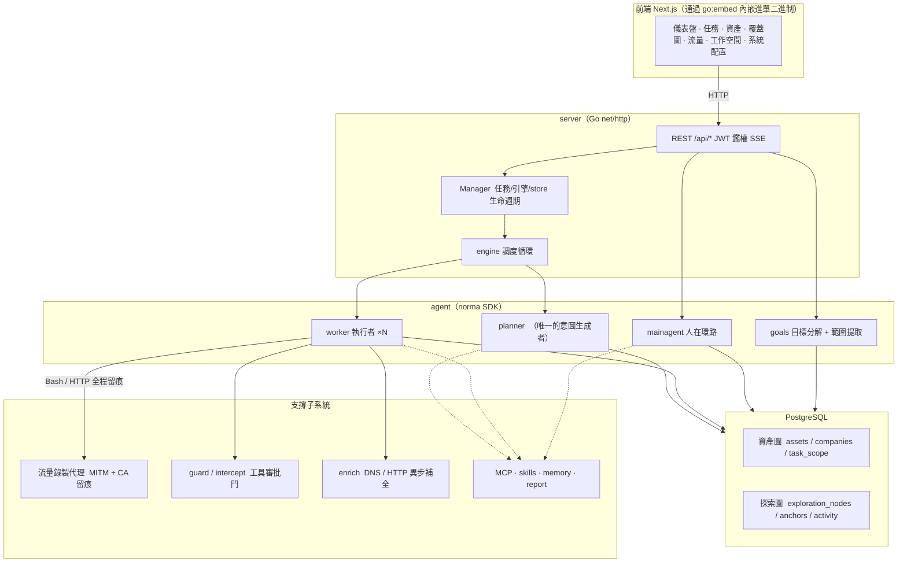
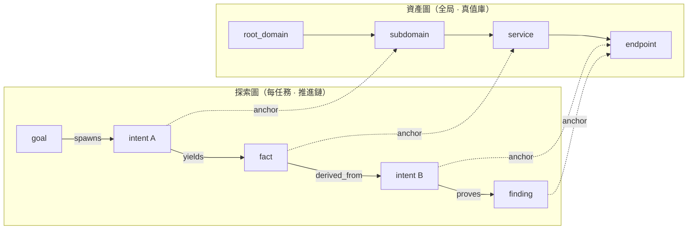
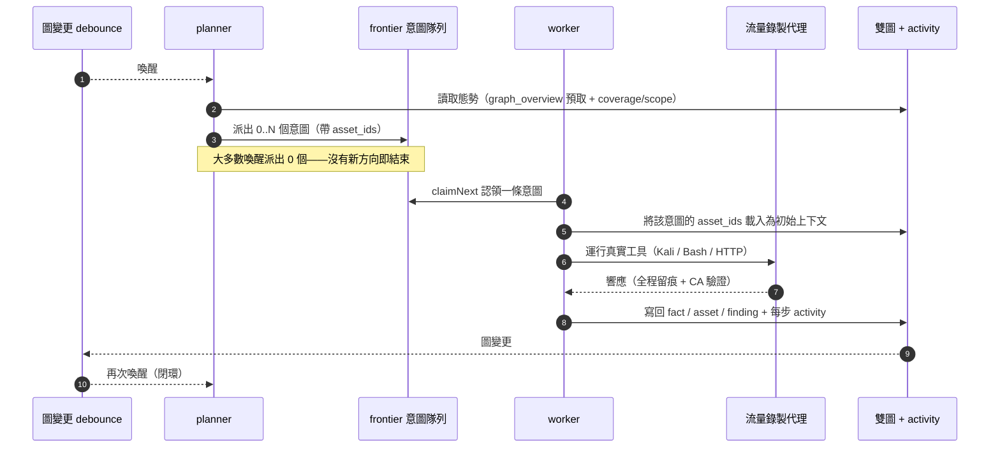
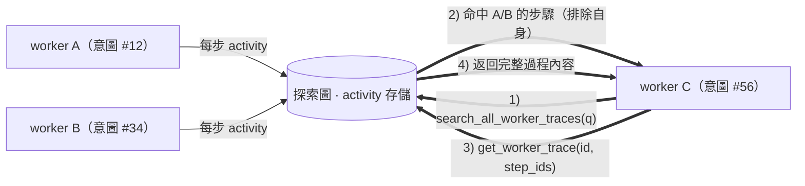
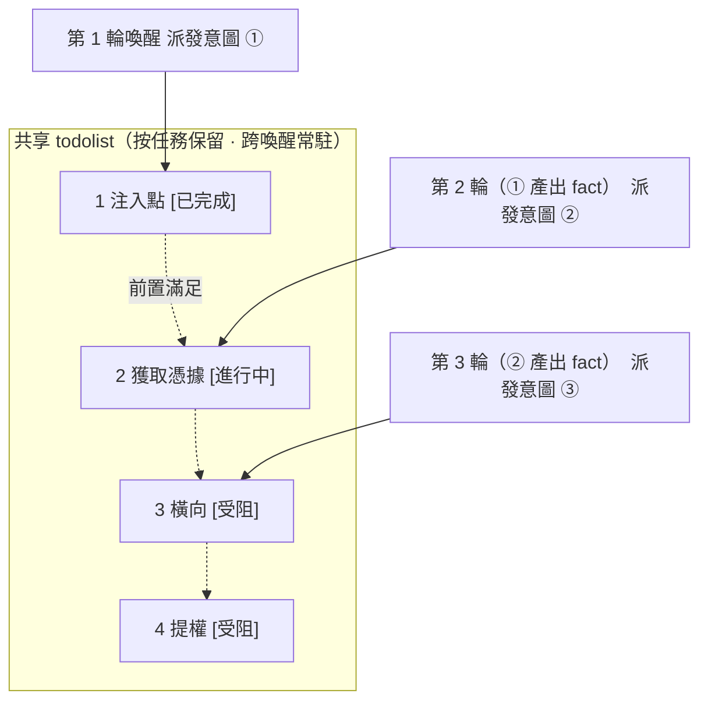

<div align="center">

# ARTIFEX

LLM 多 agent 自主滲透測試系統（Go 後端 + Next.js 前端）

[English](README.md) | 繁體中文

</div>

---

> **關於本項目。** ARTIFEX —— 一套由 [Autumn-27](https://github.com/Autumn-27/ARTEX) 開發的 LLM 多 agent 自主滲透測試系統（百度「Agent+」攻防挑戰賽冠軍項目）。本樹是 ARTEX 的 fork，已更名為 **ARTIFEX** 並保留署名；此後已與上游大幅分岔。

[驗證狀態與已知侷限](docs/VERIFICATION.md)。

> 代碼與架構源自 ARTEX。本樹在界面、文檔與分發目標中把產品更名為 ARTIFEX。條款（AGPL-3.0）見[許可與免責聲明](#許可與免責聲明)。
>
> **授權説明。** 這是一款安全測試工具。只可將其用於你擁有或明確獲得測試授權的系統。上游的使用限制仍然適用——請在下文閲讀。

---

## 語言

英文是唯一的界面語言。服務端的持久默認值是系統設置中的 `language`；`ARTIFEX_LANGUAGE` 提供環境變量層面的回退。操作系統的 `LANG` 不會決定應用語言。

請求依次參考 `lang` 參數、受支持的 `Accept-Language` 偏好、`artifex_locale` cookie，最後是服務端默認值。通過 HTTP 新建的任務會在隊列與重啓之間保留其語言；未保存語言的舊任務使用服務端默認值。內置 agent 引導與輸出指令使用本次運行的語言；用户編輯過的模板與已存儲的證據保持原樣。報告/CSV/ZIP 標籤使用導出請求的語言。[完整文檔](docs/README.md)包含內置技能指引。

## 截圖

截圖來自原上游 ARTEX（中文界面）；英文版構建的界面佈局與之相同。截圖展示的是內置演示數據，並非對真實目標的掃描。

| 儀表盤 | 任務列表 |
| :---: | :---: |
|  |  |
| 發現 | LLM |
|  |  |

---

## 審批記錄

全局「審批記錄」視圖、任務內「攔截審批」面板以及會話中展示的審批卡片均支持展開查看完整詳情。展示結構參考 [AegisHook 的審批詳情組件](https://github.com/RuoJi6/AegisHook/blob/main/web/src/components/CallDetail.vue)，沿用上游組件與主題。

## 資產同步（ScopeSentry）

支持從 [ScopeSentry](https://github.com/Autumn-27/ScopeSentry) 直接同步資產數據，免去重複收集：

- 在「**資產同步**」頁填入你的 ScopeSentry 地址與 API Key，接入數據源。
- 按**項目**或**任務**維度選擇要同步的內容，並選擇資產類型（域名 / 子域 / IP / 端口 / 站點 / 端點…）。
- 一鍵導入。資產會併入公司資產範圍，並直接進入資產圖供 agent 探索。

---

## 安裝

### GLM 及其他模型服務商

**LLM → 新建**表單內置 Z.ai 通用 API 的 GLM-5.3 配置模板，以及單獨標註的 Coding Plan 參考。請自行填入 API Key；選擇模板本身不會保存、激活或聯繫任何服務商。Coding Plan 僅限官方支持的工具使用，ARTIFEX 未在其列表中。參見[服務商配置與支持限制](docs/llm-providers.md)。

> 需要數據庫 **PostgreSQL**；探索需配置 **LLM**（`ANTHROPIC_API_KEY` 或 `OPENAI_API_KEY`，也可在 UI 中設置）。

### 方式一：一鍵安裝腳本（推薦）

```bash
git clone https://github.com/sebastian93921/ARTIFEX.git
cd artifex
./install.sh
```

腳本會檢測（並可選安裝）Docker，然後讓你選擇 **① 全部 Docker** 或 **② 本地編譯運行**：

- **① 全部 Docker**：填一個 Postgres 密碼（回車則隨機生成）→ 自動寫入 `.env` → `docker compose up -d`。
- **② 本地**：選擇數據庫（連接已有數據庫，或用 Docker 起一個）→ 自動生成 `config.json` → `go` 編譯內嵌前端的單二進制 → 啓動。

啓動後打開 **http://localhost:8787**（首次訪問會進入 `/setup` 設置管理員密碼）。

> 腳本默認使用英文。

### 方式二：Docker Compose（手動）

```bash
git clone https://github.com/sebastian93921/ARTIFEX.git
cd artifex
cp .env.example .env          # 設置 POSTGRES_PASSWORD，可選 ANTHROPIC_API_KEY
docker compose up -d --build  # 本地構建 artifex 鏡像 + postgres
# → http://localhost:8787
```

> 默認的 compose 文件會從本源碼**本地構建鏡像**。若要使用 `ghcr.io/autumn-27/artifex` 的已發佈鏡像，請在 compose 中顯式指定其版本。

鏡像已內置常用工具（ripgrep/curl/vim/npm/nmap…）；`./skills` 與 `./data` 以綁定掛載方式持久化。

遠程 MCP 可在系統設置中選擇 `http`（Streamable HTTP）或 `sse`（舊版 SSE）。舊版 SSE 服務通常使用 `GET /sse` 建立事件流，再通過服務返回的 `/message?sessionId=...` 接收 JSON-RPC 請求；配置時將 URL 填為 `/sse`，請求頭按 `Authorization=Bearer <token>` 填寫。

### 方式三：下載預編譯二進制（Releases）

> 從 [Releases](https://github.com/sebastian93921/ARTIFEX/releases) 下載對應平台的壓縮包。每個平台的壓縮包為
> `artifex-<version>-<os>-<arch>.zip`，解壓得到 `artifex` + `start.sh`
> （Windows 為 `start.bat`）+ `skills/` + `config.example.json`：

壓縮包內還包含 `adapters/agent/`；參見 [agent 配置説明](adapters/agent/README.md)。

```bash
cp config.example.json config.json   # 填好數據庫連接
./start.sh                            # → http://localhost:8787
```

> 請用 `start.sh` / `start.bat` 啓動，而不是直接運行 `./artifex`。它是個守護腳本：程序退出後按退出碼決定是否重新拉起，[應用內一鍵更新](#方式一應用內一鍵更新推薦)也依賴它完成換裝。直接運行 `./artifex` 時，更新完成後不會被重新拉起。
> 後台常駐：`nohup ./start.sh >artifex.log 2>&1 &`。

### 方式四：從源碼編譯單二進制

```bash
# 1) 將前端導出為靜態文件
cd web && npm ci && npm run build:static && cd ..
# 2) 拷貝到內嵌目錄
mkdir -p server/webui/dist
cp -R web/out/. server/webui/dist/
# 3) 編譯（embedui 標籤會內嵌前端）
CGO_ENABLED=0 go build -tags embedui -o artifex ./cmd/artifex
./start.sh
```

> 為兼容上游，構建源路徑保持 `./cmd/artifex`，Go module 保持 `github.com/sebastian93921/artifex`。僅輸出的二進制名為 `artifex`。

### 方式五：構建跨平台 Release 壓縮包

`build.sh` 會構建並嵌入前端，用 Go linker 去除調試信息，並將每個發佈版本壓縮為 zip。Release 模式默認生成 Linux amd64/arm64、macOS amd64/arm64 與 Windows amd64：

```bash
./build.sh --release
# 產物：dist/artifex-0.3.3-*.zip
```

UPX 自解壓二進制可能與部分 Linux 內核、虛擬化環境或安全策略不兼容，因此默認不啓用 UPX。可用 `ARTIFEX_TARGETS` 自定義目標平台；確認目標環境兼容後，再顯式傳入 `--upx`：

```bash
ARTIFEX_TARGETS=linux/amd64,windows/amd64 ./build.sh --release
./build.sh --target linux/amd64 --upx
```

---

## 更新升級

> 升級只換程序、不動數據：Postgres 數據卷 `pgdata`、`./data`（jwt.key / SQLite 等）與 `./skills` 都會保留。**數據庫遷移自動執行**——`artifex` 每次啓動都會冪等地重跑 `schema.sql`（包括 `ADD COLUMN` / `CREATE INDEX IF NOT EXISTS`），即「重啓即遷移」。升級前仍請備份 `./data` 與數據庫。

### 方式一：應用內一鍵更新（推薦）

在**系統配置**頁（側邊欄「系統配置」→ `/system/settings`）的**版本與更新**卡片中，無需登錄服務器即可檢查並安裝新版本。

點擊「更新」後：下載當前平台的發佈包 → 與 Release 的 `SHA256SUMS` 比對校驗 → 用 `-h` 對新二進制做冒煙測試 → 暫存為 `artifex.new` → 程序退出，由 `start.sh` / `start.bat` 重新拉起並完成換裝。頁面會等待新版本上線後自動刷新。

- **更新失敗不會留下壞程序**：校驗或冒煙測試不通過時，丟棄暫存文件，當前版本繼續運行。若換入的新版連續 3 次啓動失敗，會自動回滾到 `artifex.old`（失敗版本保留為 `artifex.failed` 供排查）。
- **隨時可回滾**：上一版本保留為 `artifex.old`，卡片上提供「回滾到上一版本」按鈕。注意數據庫結構不會回滾。
- **更新會中斷正在運行的任務**——更新即重啓，請在空閒時進行。
- **開發構建不提供更新**：版本號為 `dev` 或帶後綴的 `git describe` 字符串時禁用更新，避免正式版覆蓋本地構建的調試二進制。
- **Docker 下只換程序、不換鏡像**：鏡像內的 playwright / nmap 等工具鏈不會隨之升級，且用 `docker compose up -d` 重建容器後會退回鏡像內置的版本。要連鏡像一起升級，請使用 `docker compose pull artifex && docker compose up -d artifex`（在已有已發佈鏡像時使用；否則使用 `docker compose up -d --build artifex`）。
- 訪問 GitHub 需要代理時，在同一頁面配置**全局代理**即可，更新鏈路會使用它。更新只從 GitHub 域名下載並強制 HTTPS。

### 方式二：一鍵更新腳本

```bash
cd artifex
./update.sh
```

腳本可先執行 `git pull`，然後讓你選擇 **① Docker 更新** 或 **② 本地編譯更新**（與 `install.sh` 對應）：

- **① Docker**：用 `docker compose build artifex` 重建當前檢出的源碼，再用 `docker compose up -d artifex` 重建服務。
- **② 本地**：重建前端靜態產物 → 重新編譯 `./artifex`（重啓進程後生效）。

### 方式三：Docker Compose（手動）

```bash
cd artifex
git pull                       # 更新 compose / 腳本（可選）
# 若要固定源碼版本，請在構建前檢出經過審查的 tag 或 commit
docker compose up -d --build artifex   # 從源碼重建並重啓 → 自動遷移 schema
docker image prune -f          # 清理舊鏡像（可選）
```

> 一旦有了已發佈的鏡像且 compose 顯式選用它，請將構建步驟替換為 `docker compose pull artifex && docker compose up -d artifex`。

### 方式四：預編譯二進制（Releases）

下載新的 `artifex-<version>-<os>-<arch>.zip`，停掉舊進程，覆蓋 `artifex` 與 `skills/`（保留你的 `config.json` 與 `data/`），然後重啓：

```bash
cp -r <解壓目錄>/skills ./ && cp <解壓目錄>/artifex ./
./start.sh
```

### 方式五：從源碼編譯

```bash
git pull
cd web && npm ci && npm run build:static && cd ..
cp -r web/out server/webui/dist
CGO_ENABLED=0 go build -tags embedui -o artifex ./cmd/artifex
# 重啓 ./start.sh
```

---

## 配置

### 編碼 agent 集成

Claude Code、Codex 與 Pi 可通過 [agent 適配器](adapters/agent/README.md)創建任務、讀取進度、覆蓋情況與發現結果。Claude Code/Codex 使用本地 stdio MCP；Pi 使用原生擴展。讀取默認啓用，任務創建與暫停/恢復需通過配置顯式開啓。適配器複用現有的已認證 API，並保持 ARTIFEX 內部 agent 與模型配置不變。

**數據庫**（`config.json`，或用環境變量 `ARTIFEX_PG_DSN` 覆蓋）：

```json
{
  "database": {
    "host": "127.0.0.1", "port": 5432,
    "user": "artifex", "password": "yourpass",
    "dbname": "artifex", "sslmode": "disable"
  }
}
```

> 為兼容上游，配置與環境變量鍵保留 `ARTIFEX_*` 前綴，數據庫默認值保持 `artifex`。腳本在註明之處也接受 `ARTIFEX_*` 別名。

**LLM**：`export ANTHROPIC_API_KEY=sk-...`（或 `OPENAI_API_KEY`），也可在 UI 的「LLM 配置」頁填寫。可選：`ARTIFEX_LLM_PROVIDER` / `ARTIFEX_LLM_MODEL` / `ARTIFEX_LLM_BASE_URL` / `ARTIFEX_LLM_PROXY`。

**併發**：每個任務的 work agent 數量在「系統設置」中配置（默認 3）。

**常用參數**：`./start.sh -addr :8787 -proxy :8788`（`-addr` 為前端 + API，`-proxy` 為流量錄製代理）。啓動腳本會將參數原樣透傳給 `artifex`。

### 反向代理部署（HTTPS / 只開放 443）

前端與 API/SSE 都由同一個後端端口（默認 `:8787`）提供服務，實時活動流默認走**同源**地址——因此**無需配置 `NEXT_PUBLIC_SSE_BASE`**。公網只開放 443，把 8787 留在內網即可。

SSE 是持續推送的長連接，反向代理**必須關閉緩衝**，否則瀏覽器能連上卻收不到事件（表現為活動流一直轉圈）。Nginx 示例：

```nginx
server {
    listen 443 ssl;
    server_name your.domain.com;
    # ssl_certificate / ssl_certificate_key ...

    location / {
        proxy_pass http://127.0.0.1:8787;
        proxy_set_header Host $host;
        proxy_set_header X-Forwarded-Proto $scheme;

        # SSE 關鍵項：關緩衝、長超時、HTTP/1.1
        proxy_buffering off;
        proxy_cache off;
        proxy_read_timeout 3600s;
        proxy_http_version 1.1;
        proxy_set_header Connection "";
    }
}
```

> 僅當 SSE 流必須來自與頁面不同的源（如獨立子域）時，才需要在**構建期**設置 `NEXT_PUBLIC_SSE_BASE`（該值會在 `next build` 時固化進靜態包；容器運行時再設置無效）。

---

## 開發

### 手動漏洞複測

任務詳情的「複測」頁籤可分頁查看本任務的漏洞，展示每條漏洞的歷次結論與證據，並支持手動發起複測。啓動後保留當前頁籤，顯示轉圈圖標和「複測中」；確認修復後會同步更新漏洞狀態。

在漏洞列表某行點擊「複測」，或在漏洞詳情的「複測」區域點擊「發起複測」，填寫可選的修復版本、測試條件或限制。系統會創建獨立的複測 agent 會話並保留當前頁面。列表的平鋪視圖、按任務分組視圖與資產視圖均提供該入口；複測運行中會顯示轉圈圖標和「複測中」，點擊可進入查看會話。結束後恢復為「複測」。複測不會重啓原掃描任務。結論分為「仍可復現」「已修復」「無法確認」，每次的結論、證據與會話鏈接都保存在漏洞詳情中。

新版後端首次啓動會預置可編輯的「漏洞複測」（`retester`）agent，可在 agent 管理中配置其提示詞、LLM、運行預算與工具。默認使用其綁定的 LLM，未綁定則使用全局激活配置。當複測會話成功完成且結論為「已修復」時，系統自動將漏洞處置狀態設為「已修復」；執行中、失敗、停止或其他結論則保留原狀態。原始證據與報告始終保留。也可以在狀態下拉菜單中手動選擇「已修復」。

本版本的歷史記錄通過漏洞詳情與會話查看；暫未納入漏洞報告導出與任務歸檔，也不會自動關聯流量捕獲。演示模式只生成明確標註的模擬記錄，不會觸碰真實目標。

### 本地運行與測試

```bash
./dev.sh    # 後端(:8787) + 流量代理(:8788) + 前端 next dev(:5173) → http://localhost:5173
```

- 後端：`go run ./cmd/artifex`（不帶 `-tags embedui` 則不內嵌前端）
- 前端：`cd web && npm run dev`（`/api` 反向代理到後端，帶熱更新）
- 測試：`go test ./...`
- Mock 預覽（無後端）：`cd web && NEXT_PUBLIC_MOCK=1 npm run dev`

---

## 架構

ARTIFEX（底層實現仍為 ARTIFEX）是一套 **LLM 多 agent 自主滲透系統**：單體 Go 後端（內嵌 Next.js 前端）+ PostgreSQL。agent 能力來自 [`norma`](https://github.com/Autumn-27/norma) SDK（`agentcore` / `tool` / `permission` / `harness` / `memory` / `transcript`）。核心是**雙圖架構**，以及圍繞它構建的兩條自主性機制：**worker 間過程級信息交換**與 **planner 多輪共享 todolist 保持攻擊鏈穩定**。

### 分層



| 層 | 職責 |
| --- | --- |
| **前端** | Next.js 靜態導出，通過 `go:embed` 內嵌進單二進制；可視化任務/資產/探索/覆蓋情況與人在環路對話 |
| **server** | `net/http` 路由 + JWT 鑑權 + SSE；`Manager` 託管任務、引擎與 DB store 的生命週期 |
| **engine** | 每任務一個 `plannerLoop` + N 個 worker goroutine；意圖領取、超時/暫停/drain |
| **agent** | goals / planner / worker / mainagent；`ToolSet` 把兩張圖暴露為 LLM 工具 |
| **db** | 兩張圖的 Postgres 持久化（pgx）；schema 經 `go:embed` 內嵌，每次啓動冪等建表 |
| **支撐** | 記錄型 MITM 代理、審批門、異步補全、MCP/skills/記憶/報告 |

### 雙圖架構：探索圖 + 資產圖

系統把「**目標是什麼**」與「**測到了什麼程度**」拆分為兩張相互獨立、又通過錨點相連的圖：

- **資產圖（全局共享）**：跨任務唯一的資產真值庫。節點為 `root_domain / subdomain / ip / service / app / endpoint`，各自歸屬一家公司。域名→子域→服務→端點的父子關係與去重鍵全部由程序計算，agent 只提交原始觀察。
- **探索圖（每任務獨立）**：一次任務的「思考與推進」。節點為 `goal / intent / fact / finding / hint`，由 `spawns / derived_from / yields / proves` 等邊連成**血緣鏈**，回答「哪個方向派生自哪些事實、產出了什麼」。
- **兩圖通過錨點相連**：`exploration_anchors(node_id, asset_id)` 將意圖/事實/發現錨定到具體資產——於是既能看到某個方向正在探測哪些資產，也能從任一資產反查本任務中哪些意圖測過它、產出了哪些事實。這也支撐了**資產測試覆蓋度**與**資產覆蓋圖**（範圍內資產 + 已測高亮）。



> 分工：**planner** 讀取探索圖態勢、判斷目標，只在存在未覆蓋的新方向時才把**意圖**派入 frontier；**worker** 認領**一條意圖**、用真實工具執行、把新資產/事實/發現寫回兩張圖後即停。資產圖是共享事實，探索圖是每個任務的推進鏈。

### 引擎與意圖生命週期（一次探索的閉環）

引擎是**事件驅動**的閉環：圖變更喚醒 planner，planner 派出意圖，worker 認領意圖、執行並寫回，寫回又觸發下一輪——直到目標被證明（`prove_goal`）。



### worker 間的過程級信息交換

一次深入的探索中，許多有價值的觀察（某個報錯、某段響應、某個隱藏參數）出現在某個 worker 的**執行過程**裏，卻未必被寫成正式 fact。為避免重複勞動、讓鏈路上的 worker 能站在彼此的肩膀上，worker 可以**跨其他 worker 的過程檢索**：

- `search_all_worker_traces(q)`：在**本任務其他 work 的執行過程**裏按關鍵字檢索（自動排除本意圖自身的步驟）；命中項帶有 `intent_id`。
- `list_worker_traces` / `get_worker_trace(intent_id, step_ids=[…])`：先看有哪些 work 跑過，再取某個 work 具體幾步的完整內容做細節交換。

這樣即便探索圖上還沒有對應的 fact，後續 worker 也能複用他人在過程中得到的觀察——**信息在 worker 之間以「執行過程」為粒度流動**，而邊界保持不變（每個 worker 仍只做自己認領的那條意圖）。



### planner 多輪共享 todolist → 穩定的攻擊鏈

真實攻擊鏈往往是**有前後依賴的多步序列**（發現注入點 → 拿到憑據 → 橫向移動 → 提權），一次性把這些全部並行派下去只會亂套。因此 planner 持有一份**按任務保留、跨喚醒共享的規劃 todolist**：

- planner 是事件驅動的——圖變更會喚醒它，但**每次喚醒都是全新會話**；共享 todolist 讓它把一條串行利用鏈**記錄一次**，然後**按依賴在多輪間逐步派出意圖**，而不是在一輪裏把整條鏈前置展開。
- 每輪只為「前置步驟已完成、所依賴的 fact 已存在」的下一步派發意圖，並隨進展更新清單（把已被 fact 滿足的步驟標記為完成）。



於是攻擊鏈在「事件驅動 + 無狀態會話」的環境下依然**穩定推進、不重複、不錯序**——這正是系統能夠自主走完多步利用鏈的關鍵。

---

## 出處

ARTIFEX 基於 [Autumn-27/ARTEX](https://github.com/Autumn-27/ARTEX)，並已在本樹中更名為 ARTIFEX（中間曾有一個 ScopeWeaver 更名，已在此更名前回退）；本樹此後已與上游大幅分岔。Go module（`github.com/sebastian93921/artifex`）、構建源路徑（`./cmd/artifex`）、`ARTIFEX_*` 配置/環境變量鍵與 `artifex` 數據庫默認值均保持原樣。可執行文件名為 `artifex`；發佈壓縮包遵循 `artifex-<version>-<os>-<arch>.zip` 命名。曾有一箇中間版本的韓文本地化，現已移除；英文是唯一的界面語言，不受支持的 `ARTIFEX_LANGUAGE`/`?lang=ko` 取值會回退到英文。參見 [docs/PROVENANCE.md](docs/PROVENANCE.md)。

### 截圖

`screenshots/` 中的截圖是原上游 ARTEX 的圖片（中文界面），未作修改，出處歸屬於上游。

---

## 致謝

- **上游**：[Autumn-27/ARTEX](https://github.com/Autumn-27/ARTEX) —— 原始項目。代碼與架構出自其作者，在此致謝。
- **Agent SDK**：[`norma`](https://github.com/Autumn-27/norma)。
- **資產同步**：[ScopeSentry](https://github.com/Autumn-27/ScopeSentry)。
- **審批詳情 UI**：[AegisHook](https://github.com/RuoJi6/AegisHook)。
- **參考**：[Cairn](https://github.com/oritera/Cairn)。
- **上游社區**：ARTEX 作者運營微信公眾號 **SecSentry**（`screenshots/wx.png` 是其二維碼，作為上游資產保留）。這是上游項目的渠道，並非 ARTIFEX 的渠道。

---

## 許可與免責聲明

> 本節完整保留上游的許可協議以及作者的使用限制與免責聲明，忠實譯自 ARTIFEX 原文。條款內容未作更改。

### 開源協議

本項目採用 **GNU Affero General Public License v3.0 (AGPL-3.0)** 授權，完整條款見倉庫根目錄的 [LICENSE](LICENSE) 文件。

這意味着任何人都可以自由使用、修改和分發本項目，但**衍生作品必須同樣以 AGPL-3.0 開源**；特別地，**若你修改本項目並通過網絡（例如作為託管服務）向用户提供，也必須向這些用户公開對應的完整源碼。**

> ⚠️ **重要提示**：開源協議本身並不限制軟件的使用用途。下文的「使用限制」與「免責聲明」是作者對使用者的額外約定與鄭重聲明，請務必遵守。

**ARTIFEX 僅供個人學習、源碼研究與本地技術驗證使用，不得用於對任何線上系統或網站發起實際測試。**

### 允許使用範圍

- 僅可用於**閲讀、學習與研究本項目源碼**，以及在**本地隔離環境**中驗證技術原理。
- 適用於個人學習、學術研究、代碼審閲等非攻擊性用途。

### 禁止事項

- **嚴禁使用本工具對任何網站、線上服務或聯網系統進行掃描、探測、利用或攻擊**（無論是否獲得授權、資產是否屬於你）。
- 嚴禁將本工具用於任何實際的滲透測試、紅藍對抗演練或生產環境。
- 嚴禁將本工具用於非法入侵、數據竊取、勒索、拒絕服務或任何破壞性、犯罪性活動。
- 嚴禁利用本工具從事違反所在國家/地區法律法規的任何行為。

### 合規責任

使用者須遵守所在國家/地區關於網絡安全、數據保護與計算機犯罪的全部法律法規（在中國大陸包括但不限於《網絡安全法》《數據安全法》《個人信息保護法》及相關司法解釋）。**因使用本工具產生的一切法律責任與後果，均由使用者自行承擔。**

### 免責聲明

本項目按「現狀（AS IS）」提供，不附帶任何明示或默示的擔保。對於因使用本工具（無論使用方式是否得當）而產生的任何直接或間接損失、數據丟失、系統損壞或法律糾紛，作者及貢獻者不承擔責任。**下載、安裝或使用本項目，即表示你已閲讀、理解並同意上述全部條款。**
