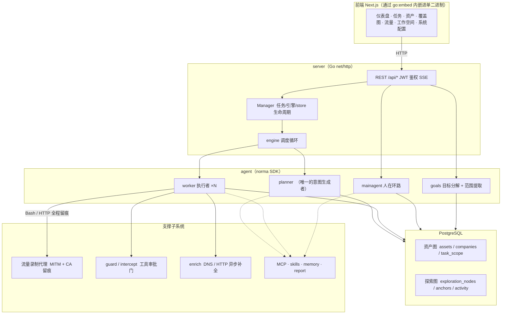
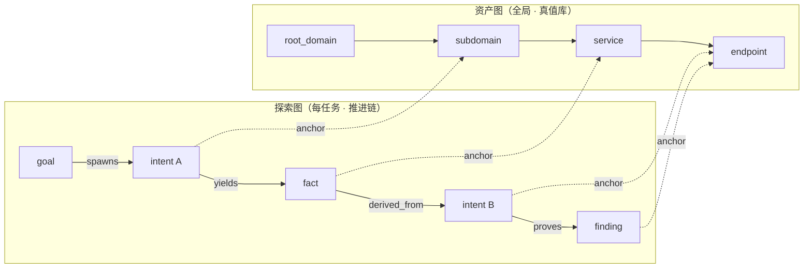
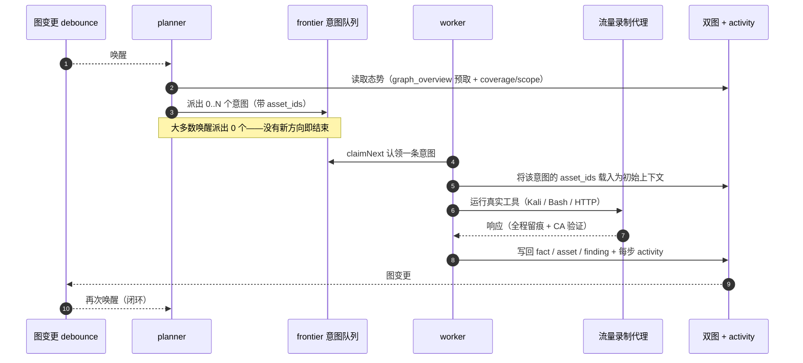
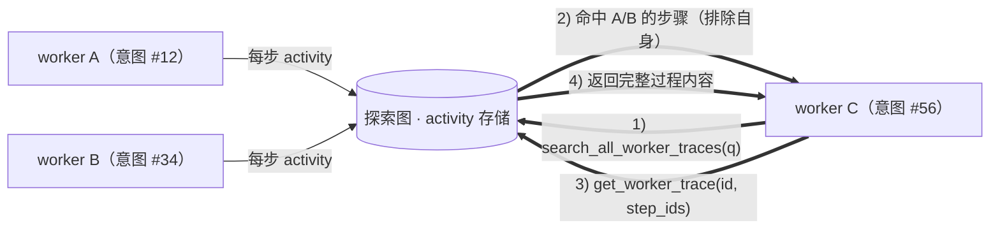
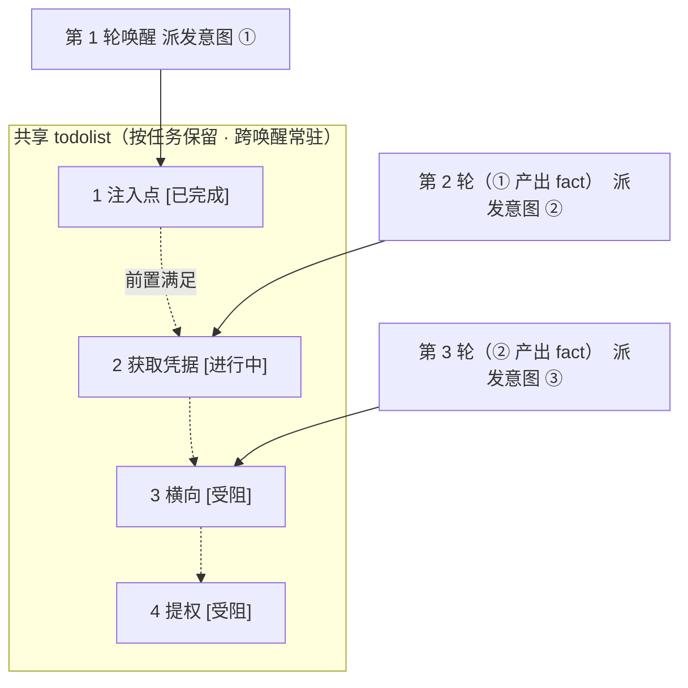

<div align="center">

# ARTIFEX

LLM 多 agent 自主渗透测试系统（Go 后端 + Next.js 前端）

[English](README.md) | 简体中文

</div>

---

> **关于本项目。** ARTIFEX —— 一套由 [Autumn-27](https://github.com/Autumn-27/ARTEX) 开发的 LLM 多 agent 自主渗透测试系统（百度「Agent+」攻防挑战赛冠军项目）。基于上游 commit `160fe13` 构建；本树将产品更名为 **ARTIFEX**，并保留署名。

[验证状态与已知局限](docs/VERIFICATION.md)。

> 代码与架构源自 ARTEX。本树在界面、文档与分发目标中把产品更名为 ARTIFEX。条款（AGPL-3.0）见[许可与免责声明](#许可与免责声明)。
>
> **授权说明。** 这是一款安全测试工具。只可将其用于你拥有或明确获得测试授权的系统。上游的使用限制仍然适用——请在下文阅读。

---

## 语言

英文是唯一的界面语言。服务端的持久默认值是系统设置中的 `language`；`ARTIFEX_LANGUAGE` 提供环境变量层面的回退。操作系统的 `LANG` 不会决定应用语言。

请求依次参考 `lang` 参数、受支持的 `Accept-Language` 偏好、`artifex_locale` cookie，最后是服务端默认值。通过 HTTP 新建的任务会在队列与重启之间保留其语言；未保存语言的旧任务使用服务端默认值。内置 agent 引导与输出指令使用本次运行的语言；用户编辑过的模板与已存储的证据保持原样。报告/CSV/ZIP 标签使用导出请求的语言。[完整文档](docs/README.md)包含内置技能指引。

## 截图

截图来自原上游 ARTEX（中文界面）；英文版构建的界面布局与之相同。截图展示的是内置演示数据，并非对真实目标的扫描。

| 仪表盘 | 任务列表 |
| :---: | :---: |
|  |  |
| 发现 | LLM |
|  |  |

---

## 审批记录

全局「审批记录」视图、任务内「拦截审批」面板以及会话中展示的审批卡片均支持展开查看完整详情。展示结构参考 [AegisHook 的审批详情组件](https://github.com/RuoJi6/AegisHook/blob/main/web/src/components/CallDetail.vue)，沿用上游组件与主题。

## 资产同步（ScopeSentry）

支持从 [ScopeSentry](https://github.com/Autumn-27/ScopeSentry) 直接同步资产数据，免去重复收集：

- 在「**资产同步**」页填入你的 ScopeSentry 地址与 API Key，接入数据源。
- 按**项目**或**任务**维度选择要同步的内容，并选择资产类型（域名 / 子域 / IP / 端口 / 站点 / 端点…）。
- 一键导入。资产会并入公司资产范围，并直接进入资产图供 agent 探索。

---

## 安装

### GLM 及其他模型服务商

**LLM → 新建**表单内置 Z.ai 通用 API 的 GLM-5.3 配置模板，以及单独标注的 Coding Plan 参考。请自行填入 API Key；选择模板本身不会保存、激活或联系任何服务商。Coding Plan 仅限官方支持的工具使用，ARTIFEX 未在其列表中。参见[服务商配置与支持限制](docs/llm-providers.md)。

> 需要数据库 **PostgreSQL**；探索需配置 **LLM**（`ANTHROPIC_API_KEY` 或 `OPENAI_API_KEY`，也可在 UI 中设置）。

### 方式一：一键安装脚本（推荐）

```bash
git clone https://github.com/sebastian93921/ARTIFEX.git
cd artifex
./install.sh
```

脚本会检测（并可选安装）Docker，然后让你选择 **① 全部 Docker** 或 **② 本地编译运行**：

- **① 全部 Docker**：填一个 Postgres 密码（回车则随机生成）→ 自动写入 `.env` → `docker compose up -d`。
- **② 本地**：选择数据库（连接已有数据库，或用 Docker 起一个）→ 自动生成 `config.json` → `go` 编译内嵌前端的单二进制 → 启动。

启动后打开 **http://localhost:8787**（首次访问会进入 `/setup` 设置管理员密码）。

> 脚本默认使用英文。

### 方式二：Docker Compose（手动）

```bash
git clone https://github.com/sebastian93921/ARTIFEX.git
cd artifex
cp .env.example .env          # 设置 POSTGRES_PASSWORD，可选 ANTHROPIC_API_KEY
docker compose up -d --build  # 本地构建 artifex 镜像 + postgres
# → http://localhost:8787
```

> 默认的 compose 文件会从本源码**本地构建镜像**。若要使用 `ghcr.io/autumn-27/artifex` 的已发布镜像，请在 compose 中显式指定其版本。

镜像已内置常用工具（ripgrep/curl/vim/npm/nmap…）；`./skills` 与 `./data` 以绑定挂载方式持久化。

远程 MCP 可在系统设置中选择 `http`（Streamable HTTP）或 `sse`（旧版 SSE）。旧版 SSE 服务通常使用 `GET /sse` 建立事件流，再通过服务返回的 `/message?sessionId=...` 接收 JSON-RPC 请求；配置时将 URL 填为 `/sse`，请求头按 `Authorization=Bearer <token>` 填写。

### 方式三：下载预编译二进制（Releases）

> 从 [Releases](https://github.com/sebastian93921/ARTIFEX/releases) 下载对应平台的压缩包。每个平台的压缩包为
> `artifex-<version>-<os>-<arch>.zip`，解压得到 `artifex` + `start.sh`
> （Windows 为 `start.bat`）+ `skills/` + `config.example.json`：

压缩包内还包含 `adapters/agent/`；参见 [agent 配置说明](adapters/agent/README.md)。

```bash
cp config.example.json config.json   # 填好数据库连接
./start.sh                            # → http://localhost:8787
```

> 请用 `start.sh` / `start.bat` 启动，而不是直接运行 `./artifex`。它是个守护脚本：程序退出后按退出码决定是否重新拉起，[应用内一键更新](#方式一应用内一键更新推荐)也依赖它完成换装。直接运行 `./artifex` 时，更新完成后不会被重新拉起。
> 后台常驻：`nohup ./start.sh >artifex.log 2>&1 &`。

### 方式四：从源码编译单二进制

```bash
# 1) 将前端导出为静态文件
cd web && npm ci && npm run build:static && cd ..
# 2) 拷贝到内嵌目录
mkdir -p server/webui/dist
cp -R web/out/. server/webui/dist/
# 3) 编译（embedui 标签会内嵌前端）
CGO_ENABLED=0 go build -tags embedui -o artifex ./cmd/artifex
./start.sh
```

> 为兼容上游，构建源路径保持 `./cmd/artifex`，Go module 保持 `github.com/sebastian93921/artifex`。仅输出的二进制名为 `artifex`。

### 方式五：构建跨平台 Release 压缩包

`build.sh` 会构建并嵌入前端，用 Go linker 去除调试信息，并将每个发布版本压缩为 zip。Release 模式默认生成 Linux amd64/arm64、macOS amd64/arm64 与 Windows amd64：

```bash
./build.sh --release
# 产物：dist/artifex-0.3.3-*.zip
```

UPX 自解压二进制可能与部分 Linux 内核、虚拟化环境或安全策略不兼容，因此默认不启用 UPX。可用 `ARTIFEX_TARGETS` 自定义目标平台；确认目标环境兼容后，再显式传入 `--upx`：

```bash
ARTIFEX_TARGETS=linux/amd64,windows/amd64 ./build.sh --release
./build.sh --target linux/amd64 --upx
```

---

## 更新升级

> 升级只换程序、不动数据：Postgres 数据卷 `pgdata`、`./data`（jwt.key / SQLite 等）与 `./skills` 都会保留。**数据库迁移自动执行**——`artifex` 每次启动都会幂等地重跑 `schema.sql`（包括 `ADD COLUMN` / `CREATE INDEX IF NOT EXISTS`），即「重启即迁移」。升级前仍请备份 `./data` 与数据库。

### 方式一：应用内一键更新（推荐）

在**系统配置**页（侧边栏「系统配置」→ `/system/settings`）的**版本与更新**卡片中，无需登录服务器即可检查并安装新版本。

点击「更新」后：下载当前平台的发布包 → 与 Release 的 `SHA256SUMS` 比对校验 → 用 `-h` 对新二进制做冒烟测试 → 暂存为 `artifex.new` → 程序退出，由 `start.sh` / `start.bat` 重新拉起并完成换装。页面会等待新版本上线后自动刷新。

- **更新失败不会留下坏程序**：校验或冒烟测试不通过时，丢弃暂存文件，当前版本继续运行。若换入的新版连续 3 次启动失败，会自动回滚到 `artifex.old`（失败版本保留为 `artifex.failed` 供排查）。
- **随时可回滚**：上一版本保留为 `artifex.old`，卡片上提供「回滚到上一版本」按钮。注意数据库结构不会回滚。
- **更新会中断正在运行的任务**——更新即重启，请在空闲时进行。
- **开发构建不提供更新**：版本号为 `dev` 或带后缀的 `git describe` 字符串时禁用更新，避免正式版覆盖本地构建的调试二进制。
- **Docker 下只换程序、不换镜像**：镜像内的 playwright / nmap 等工具链不会随之升级，且用 `docker compose up -d` 重建容器后会退回镜像内置的版本。要连镜像一起升级，请使用 `docker compose pull artifex && docker compose up -d artifex`（在已有已发布镜像时使用；否则使用 `docker compose up -d --build artifex`）。
- 访问 GitHub 需要代理时，在同一页面配置**全局代理**即可，更新链路会使用它。更新只从 GitHub 域名下载并强制 HTTPS。

### 方式二：一键更新脚本

```bash
cd artifex
./update.sh
```

脚本可先执行 `git pull`，然后让你选择 **① Docker 更新** 或 **② 本地编译更新**（与 `install.sh` 对应）：

- **① Docker**：用 `docker compose build artifex` 重建当前检出的源码，再用 `docker compose up -d artifex` 重建服务。
- **② 本地**：重建前端静态产物 → 重新编译 `./artifex`（重启进程后生效）。

### 方式三：Docker Compose（手动）

```bash
cd artifex
git pull                       # 更新 compose / 脚本（可选）
# 若要固定源码版本，请在构建前检出经过审查的 tag 或 commit
docker compose up -d --build artifex   # 从源码重建并重启 → 自动迁移 schema
docker image prune -f          # 清理旧镜像（可选）
```

> 一旦有了已发布的镜像且 compose 显式选用它，请将构建步骤替换为 `docker compose pull artifex && docker compose up -d artifex`。

### 方式四：预编译二进制（Releases）

下载新的 `artifex-<version>-<os>-<arch>.zip`，停掉旧进程，覆盖 `artifex` 与 `skills/`（保留你的 `config.json` 与 `data/`），然后重启：

```bash
cp -r <解压目录>/skills ./ && cp <解压目录>/artifex ./
./start.sh
```

### 方式五：从源码编译

```bash
git pull
cd web && npm ci && npm run build:static && cd ..
cp -r web/out server/webui/dist
CGO_ENABLED=0 go build -tags embedui -o artifex ./cmd/artifex
# 重启 ./start.sh
```

---

## 配置

### 编码 agent 集成

Claude Code、Codex 与 Pi 可通过 [agent 适配器](adapters/agent/README.md)创建任务、读取进度、覆盖情况与发现结果。Claude Code/Codex 使用本地 stdio MCP；Pi 使用原生扩展。读取默认启用，任务创建与暂停/恢复需通过配置显式开启。适配器复用现有的已认证 API，并保持 ARTIFEX 内部 agent 与模型配置不变。

**数据库**（`config.json`，或用环境变量 `ARTIFEX_PG_DSN` 覆盖）：

```json
{
  "database": {
    "host": "127.0.0.1", "port": 5432,
    "user": "artifex", "password": "yourpass",
    "dbname": "artifex", "sslmode": "disable"
  }
}
```

> 为兼容上游，配置与环境变量键保留 `ARTIFEX_*` 前缀，数据库默认值保持 `artifex`。脚本在注明之处也接受 `ARTIFEX_*` 别名。

**LLM**：`export ANTHROPIC_API_KEY=sk-...`（或 `OPENAI_API_KEY`），也可在 UI 的「LLM 配置」页填写。可选：`ARTIFEX_LLM_PROVIDER` / `ARTIFEX_LLM_MODEL` / `ARTIFEX_LLM_BASE_URL` / `ARTIFEX_LLM_PROXY`。

**并发**：每个任务的 work agent 数量在「系统设置」中配置（默认 3）。

**常用参数**：`./start.sh -addr :8787 -proxy :8788`（`-addr` 为前端 + API，`-proxy` 为流量录制代理）。启动脚本会将参数原样透传给 `artifex`。

### 反向代理部署（HTTPS / 只开放 443）

前端与 API/SSE 都由同一个后端端口（默认 `:8787`）提供服务，实时活动流默认走**同源**地址——因此**无需配置 `NEXT_PUBLIC_SSE_BASE`**。公网只开放 443，把 8787 留在内网即可。

SSE 是持续推送的长连接，反向代理**必须关闭缓冲**，否则浏览器能连上却收不到事件（表现为活动流一直转圈）。Nginx 示例：

```nginx
server {
    listen 443 ssl;
    server_name your.domain.com;
    # ssl_certificate / ssl_certificate_key ...

    location / {
        proxy_pass http://127.0.0.1:8787;
        proxy_set_header Host $host;
        proxy_set_header X-Forwarded-Proto $scheme;

        # SSE 关键项：关缓冲、长超时、HTTP/1.1
        proxy_buffering off;
        proxy_cache off;
        proxy_read_timeout 3600s;
        proxy_http_version 1.1;
        proxy_set_header Connection "";
    }
}
```

> 仅当 SSE 流必须来自与页面不同的源（如独立子域）时，才需要在**构建期**设置 `NEXT_PUBLIC_SSE_BASE`（该值会在 `next build` 时固化进静态包；容器运行时再设置无效）。

---

## 开发

### 手动漏洞复测

任务详情的「复测」页签可分页查看本任务的漏洞，展示每条漏洞的历次结论与证据，并支持手动发起复测。启动后保留当前页签，显示转圈图标和「复测中」；确认修复后会同步更新漏洞状态。

在漏洞列表某行点击「复测」，或在漏洞详情的「复测」区域点击「发起复测」，填写可选的修复版本、测试条件或限制。系统会创建独立的复测 agent 会话并保留当前页面。列表的平铺视图、按任务分组视图与资产视图均提供该入口；复测运行中会显示转圈图标和「复测中」，点击可进入查看会话。结束后恢复为「复测」。复测不会重启原扫描任务。结论分为「仍可复现」「已修复」「无法确认」，每次的结论、证据与会话链接都保存在漏洞详情中。

新版后端首次启动会预置可编辑的「漏洞复测」（`retester`）agent，可在 agent 管理中配置其提示词、LLM、运行预算与工具。默认使用其绑定的 LLM，未绑定则使用全局激活配置。当复测会话成功完成且结论为「已修复」时，系统自动将漏洞处置状态设为「已修复」；执行中、失败、停止或其他结论则保留原状态。原始证据与报告始终保留。也可以在状态下拉菜单中手动选择「已修复」。

本版本的历史记录通过漏洞详情与会话查看；暂未纳入漏洞报告导出与任务归档，也不会自动关联流量捕获。演示模式只生成明确标注的模拟记录，不会触碰真实目标。

### 本地运行与测试

```bash
./dev.sh    # 后端(:8787) + 流量代理(:8788) + 前端 next dev(:5173) → http://localhost:5173
```

- 后端：`go run ./cmd/artifex`（不带 `-tags embedui` 则不内嵌前端）
- 前端：`cd web && npm run dev`（`/api` 反向代理到后端，带热更新）
- 测试：`go test ./...`
- Mock 预览（无后端）：`cd web && NEXT_PUBLIC_MOCK=1 npm run dev`

---

## 架构

ARTIFEX（底层实现仍为 ARTIFEX）是一套 **LLM 多 agent 自主渗透系统**：单体 Go 后端（内嵌 Next.js 前端）+ PostgreSQL。agent 能力来自 [`norma`](https://github.com/Autumn-27/norma) SDK（`agentcore` / `tool` / `permission` / `harness` / `memory` / `transcript`）。核心是**双图架构**，以及围绕它构建的两条自主性机制：**worker 间过程级信息交换**与 **planner 多轮共享 todolist 保持攻击链稳定**。

### 分层



| 层 | 职责 |
| --- | --- |
| **前端** | Next.js 静态导出，通过 `go:embed` 内嵌进单二进制；可视化任务/资产/探索/覆盖情况与人在环路对话 |
| **server** | `net/http` 路由 + JWT 鉴权 + SSE；`Manager` 托管任务、引擎与 DB store 的生命周期 |
| **engine** | 每任务一个 `plannerLoop` + N 个 worker goroutine；意图领取、超时/暂停/drain |
| **agent** | goals / planner / worker / mainagent；`ToolSet` 把两张图暴露为 LLM 工具 |
| **db** | 两张图的 Postgres 持久化（pgx）；schema 经 `go:embed` 内嵌，每次启动幂等建表 |
| **支撑** | 记录型 MITM 代理、审批门、异步补全、MCP/skills/记忆/报告 |

### 双图架构：探索图 + 资产图

系统把「**目标是什么**」与「**测到了什么程度**」拆分为两张相互独立、又通过锚点相连的图：

- **资产图（全局共享）**：跨任务唯一的资产真值库。节点为 `root_domain / subdomain / ip / service / app / endpoint`，各自归属一家公司。域名→子域→服务→端点的父子关系与去重键全部由程序计算，agent 只提交原始观察。
- **探索图（每任务独立）**：一次任务的「思考与推进」。节点为 `goal / intent / fact / finding / hint`，由 `spawns / derived_from / yields / proves` 等边连成**血缘链**，回答「哪个方向派生自哪些事实、产出了什么」。
- **两图通过锚点相连**：`exploration_anchors(node_id, asset_id)` 将意图/事实/发现锚定到具体资产——于是既能看到某个方向正在探测哪些资产，也能从任一资产反查本任务中哪些意图测过它、产出了哪些事实。这也支撑了**资产测试覆盖度**与**资产覆盖图**（范围内资产 + 已测高亮）。



> 分工：**planner** 读取探索图态势、判断目标，只在存在未覆盖的新方向时才把**意图**派入 frontier；**worker** 认领**一条意图**、用真实工具执行、把新资产/事实/发现写回两张图后即停。资产图是共享事实，探索图是每个任务的推进链。

### 引擎与意图生命周期（一次探索的闭环）

引擎是**事件驱动**的闭环：图变更唤醒 planner，planner 派出意图，worker 认领意图、执行并写回，写回又触发下一轮——直到目标被证明（`prove_goal`）。



### worker 间的过程级信息交换

一次深入的探索中，许多有价值的观察（某个报错、某段响应、某个隐藏参数）出现在某个 worker 的**执行过程**里，却未必被写成正式 fact。为避免重复劳动、让链路上的 worker 能站在彼此的肩膀上，worker 可以**跨其他 worker 的过程检索**：

- `search_all_worker_traces(q)`：在**本任务其他 work 的执行过程**里按关键字检索（自动排除本意图自身的步骤）；命中项带有 `intent_id`。
- `list_worker_traces` / `get_worker_trace(intent_id, step_ids=[…])`：先看有哪些 work 跑过，再取某个 work 具体几步的完整内容做细节交换。

这样即便探索图上还没有对应的 fact，后续 worker 也能复用他人在过程中得到的观察——**信息在 worker 之间以「执行过程」为粒度流动**，而边界保持不变（每个 worker 仍只做自己认领的那条意图）。



### planner 多轮共享 todolist → 稳定的攻击链

真实攻击链往往是**有前后依赖的多步序列**（发现注入点 → 拿到凭据 → 横向移动 → 提权），一次性把这些全部并行派下去只会乱套。因此 planner 持有一份**按任务保留、跨唤醒共享的规划 todolist**：

- planner 是事件驱动的——图变更会唤醒它，但**每次唤醒都是全新会话**；共享 todolist 让它把一条串行利用链**记录一次**，然后**按依赖在多轮间逐步派出意图**，而不是在一轮里把整条链前置展开。
- 每轮只为「前置步骤已完成、所依赖的 fact 已存在」的下一步派发意图，并随进展更新清单（把已被 fact 满足的步骤标记为完成）。



于是攻击链在「事件驱动 + 无状态会话」的环境下依然**稳定推进、不重复、不错序**——这正是系统能够自主走完多步利用链的关键。

---

## 出处

ARTIFEX 基于 [Autumn-27/ARTEX](https://github.com/Autumn-27/ARTEX) 的上游 commit `160fe13`，并在本树中更名为 ARTIFEX（中间曾有一个 ScopeWeaver 更名，已在此更名前回退）。Go module（`github.com/sebastian93921/artifex`）、构建源路径（`./cmd/artifex`）、`ARTIFEX_*` 配置/环境变量键与 `artifex` 数据库默认值均保持原样。可执行文件名为 `artifex`；发布压缩包遵循 `artifex-<version>-<os>-<arch>.zip` 命名。曾有一个中间版本的韩文本地化，现已移除；英文是唯一的界面语言，不受支持的 `ARTIFEX_LANGUAGE`/`?lang=ko` 取值会回退到英文。参见 [docs/PROVENANCE.md](docs/PROVENANCE.md)。

### 截图

`screenshots/` 中的截图是原上游 ARTEX 的图片（中文界面），未作修改，出处归属于上游。

---

## 致谢

- **上游**：[Autumn-27/ARTEX](https://github.com/Autumn-27/ARTEX) —— 原始项目。代码与架构出自其作者，在此致谢。
- **Agent SDK**：[`norma`](https://github.com/Autumn-27/norma)。
- **资产同步**：[ScopeSentry](https://github.com/Autumn-27/ScopeSentry)。
- **审批详情 UI**：[AegisHook](https://github.com/RuoJi6/AegisHook)。
- **参考**：[Cairn](https://github.com/oritera/Cairn)。
- **上游社区**：ARTEX 作者运营微信公众号 **SecSentry**（`screenshots/wx.png` 是其二维码，作为上游资产保留）。这是上游项目的渠道，并非 ARTIFEX 的渠道。

---

## 许可与免责声明

> 本节完整保留上游的许可协议以及作者的使用限制与免责声明，忠实译自 ARTIFEX 原文。条款内容未作更改。

### 开源协议

本项目采用 **GNU Affero General Public License v3.0 (AGPL-3.0)** 授权，完整条款见仓库根目录的 [LICENSE](LICENSE) 文件。

这意味着任何人都可以自由使用、修改和分发本项目，但**衍生作品必须同样以 AGPL-3.0 开源**；特别地，**若你修改本项目并通过网络（例如作为托管服务）向用户提供，也必须向这些用户公开对应的完整源码。**

> ⚠️ **重要提示**：开源协议本身并不限制软件的使用用途。下文的「使用限制」与「免责声明」是作者对使用者的额外约定与郑重声明，请务必遵守。

**ARTIFEX 仅供个人学习、源码研究与本地技术验证使用，不得用于对任何线上系统或网站发起实际测试。**

### 允许使用范围

- 仅可用于**阅读、学习与研究本项目源码**，以及在**本地隔离环境**中验证技术原理。
- 适用于个人学习、学术研究、代码审阅等非攻击性用途。

### 禁止事项

- **严禁使用本工具对任何网站、线上服务或联网系统进行扫描、探测、利用或攻击**（无论是否获得授权、资产是否属于你）。
- 严禁将本工具用于任何实际的渗透测试、红蓝对抗演练或生产环境。
- 严禁将本工具用于非法入侵、数据窃取、勒索、拒绝服务或任何破坏性、犯罪性活动。
- 严禁利用本工具从事违反所在国家/地区法律法规的任何行为。

### 合规责任

使用者须遵守所在国家/地区关于网络安全、数据保护与计算机犯罪的全部法律法规（在中国大陆包括但不限于《网络安全法》《数据安全法》《个人信息保护法》及相关司法解释）。**因使用本工具产生的一切法律责任与后果，均由使用者自行承担。**

### 免责声明

本项目按「现状（AS IS）」提供，不附带任何明示或默示的担保。对于因使用本工具（无论使用方式是否得当）而产生的任何直接或间接损失、数据丢失、系统损坏或法律纠纷，作者及贡献者不承担责任。**下载、安装或使用本项目，即表示你已阅读、理解并同意上述全部条款。**
