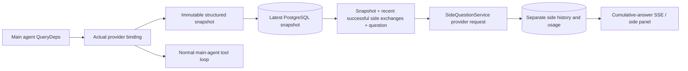

# ARTIFEX `/btw`

[한국어](../docs/ko/sidequestion/README.md)

Ordinary chat, a task's MainAgent, and Workers belonging to the current task support independent side questions. Enter `/btw question` in the main input to submit; an empty `/btw` or the side-question button opens history. Desktop uses a resizable sidebar, while mobile uses a Drawer.

Answers use the agent context snapshot at submission and support streaming, follow-ups, stopping and clearing. Closing the panel, refreshing or disconnecting SSE does not cancel the model request. Stop affects only the current side question. Clear cancels it and deletes side-question history while retaining the main context snapshot.

## Implementation boundaries

The upstream implementation used Go, norma v0.3.7, Next.js and existing Markdown / ResizablePanel / Drawer / AlertDialog components, without changing norma source or adding a side-question dependency. Planner support, Workers inherited from other tasks and tool-subtask upgrades were outside its scope. Dependency versions may have advanced since that implementation.

- `capture.go` marks main-loop requests only in `Options.Deps.CallModel / CallModelSync`. The provider decorator sits inside the concrete model after outer pool routing, so it records the actual selected model. Compaction and summary requests do not overwrite snapshots.
- Snapshots publish at request start, complete model response and terminal run state. Partial responses are excluded. norma's `MessagesForAPI` keeps tool calls paired; results enter the snapshot at the next main-model request or terminal state. Interrupted streams retain the last valid boundary.
- JSON deep copies preserve structured messages, system instructions, tool definitions and generation parameters. Model inference holds neither snapshot locks nor database transactions.
- `SideQuestionService` calls the concrete provider and summarizes first if needed. The final answer may shrink context and retry once only after its first context-overflow error and before any text/tool-call output. It creates no agent session and connects to no tool executor, main transcript, activity stream, task graph or task-model switching chain. Answer requests keep tool definitions for existing structured tool context; summary requests omit tools. New tool calls have no execution path.
- Each parent session allows one running request; each service process allows four, with a 120-second request timeout. Side questions have independent cancellation contexts under the service lifecycle.
- Requests retain a model-profile reference and a nonsensitive identity digest; credentials come from the current profile at request time. If the profile is deleted or identity fields such as model, protocol or address change, run the main agent to refresh its snapshot. Tests do not change the product's default model.

## Persistence and recovery

`db/schema.sql` creates `side_question_sessions` and `side_question_requests`. Sessions store the parent resource, latest snapshot, run ID, version and clear version. Requests store the question, cumulative answer, status, model, snapshot time, usage, event sequence and pagination ordinal.

Parent keys use conversation ID, or task ID + exploration ID + intent ID. Workers do not use reusable execution-slot names.

Snapshot writes coalesce per parent and flush every 250 ms. The database compares `(run_id, version)` to reject stale writes. The selected snapshot is saved again before side-question submission. Successful saves release the large in-memory snapshot; failures retain the pending version. Cumulative streaming answers write at most every 250 ms. Terminal states save immediately with bounded retries on database errors.

Startup marks leftover `running` requests `interrupted`, retaining saved partial answers and usage without replaying requests. The latest successfully saved context can answer the next question directly. Old sessions without a snapshot require running the main agent first; context is not reconstructed from UI activity logs.

Clear increments the clear version and deletes requests; conditional updates reject late callbacks. Physical parent deletion uses foreign-key cascades. Logical Worker deletion removes side data in the same transaction and rejects later snapshots. Task archiving first blocks new requests, waits for the main flow to stop, cancels side requests and waits for persistence. Archive v3 also supports v1/v2 without side-question tables.

Full history is retained and paginated by ordinal, up to 20 records per page. Model requests replay at most 20 recent successful exchanges, further constrained by token budget. Older exchanges have a separate rolling summary. If the main context is too large, only the older part of the side copy is summarized, keeping recent structured tool calls/results. Summaries, preparation and usage share side-question concurrency, cancellation and the 120-second timeout. See [context budgets and upstream references](CONTEXT_BUDGET.md).

## HTTP contract

These existing authenticated and resource-checked paths act as `{parent}`:

- `/api/conversations/{id}`
- `/api/tasks/{id}/chat`
- `/api/tasks/{id}/intents/{iid}`

| Request | Response and behavior |
| --- | --- |
| `GET {parent}/side-questions?before={ordinal}` | Newest-first `items`, separate running `current`, `snapshot` metadata, `next_cursor`; 0 means newest page / no next page |
| `POST {parent}/side-questions` | JSON `{ "question": "…", "client_request_id": "UUID" }`; new requests return 202 and request object; identical ID/question returns existing object with 200 |
| `DELETE {parent}/side-questions` | Cancel and clear this parent's side questions |
| `GET /api/side-questions/{requestID}/events` | `snapshot` SSE events: increasing sequence `id`, complete cumulative request object in `data`; clear sends `cleared` |
| `POST /api/side-questions/{requestID}/cancel` | Explicit cancellation; read terminal state through history or SSE |

Questions are limited to 4000 characters. Missing snapshots, changed profiles, busy parents and conflicting idempotency IDs return 409; the global concurrency limit returns 429. Every SSE connection starts with cumulative state rather than depending on previously received fragments. The frontend merges by request ID + sequence and discards old callbacks when switching parents or clearing.

## Verification and references

[VALIDATION.md](VALIDATION.md) records upstream automated checks, actual model use and known limits. These historical receipts are not fresh ARTIFEX test results.

Independent requests reference [Grok CLI side-question.ts at a fixed commit](https://github.com/superagent-ai/grok-cli/blob/fb97af83f06dca873281d60168430f06c8de6324/src/utils/side-question.ts); execution isolation references [OpenCode at a fixed commit](https://github.com/anomalyco/opencode/tree/b3f1a96c6dd7adeb28b36dd11add1998fc84d67b). ARTIFEX used norma's structured messages rather than reconstructing text from frontend logs; ARTIFEX retains that implementation.
