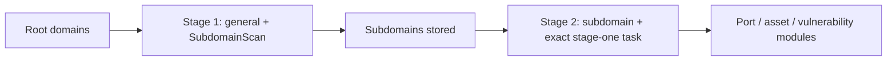

# ScopeSentry MCP guide


## 1. Preparation

### 1.1 Check service access

- Default web interface: `http://<host>`
- MCP endpoint: `http://<host>/mcp`. Use the actual `/mcp` address if a reverse/frontend proxy is present.

### 1.2 Create an API key

1. Sign in to the ScopeSentry web interface.
2. Create a key on the API Key management page, or through an administrator-provided API.
3. Save the returned `ssk_...` string; it is shown only once.

### 1.3 Configure Cursor MCP

In Cursor, open Settings → MCP → Add server:

```json
{
  "mcpServers": {
    "scopesentry": {
      "url": "http://<your-host>:8082/mcp",
      "headers": {"X-API-Key": "ssk_your-key"}
    }
  }
}
```

`Authorization: Bearer ssk_your-key` also works. Restart MCP or reload Cursor, then confirm tools such as `list_projects` and `list_assets` appear.

## 2. Tools

| Tool | Purpose |
| --- | --- |
| `list_projects` | Project tree grouped by tags, including IDs |
| `list_projects_data` | Paginated projects, searchable by name |
| `get_project` | Project details |
| `create_project` | Create a project |
| `list_tasks` | Scan tasks |
| `get_task` | Task details |
| `list_scan_templates` | Scan templates |
| `get_scan_template` | Template details |
| `list_plugin_modules` | Scan-pipeline module names |
| `list_plugins` | Available plugins, hashes and default parameters |
| `create_scan_template` | Create a scan template |
| `create_scan_task` | Create a scan task |
| `list_assets` | Paginated asset queries |
| `count_assets` | Asset counts (`/api/assets/common/total`) |
| `get_asset_detail` | Asset or vulnerability details |
| `add_asset_tag` | Add an asset tag |
| `list_nodes` | Scan nodes |

The MCP tool schema is authoritative for parameters. `list_assets` and `count_assets` share search/filter syntax; read the `list_assets` description before querying. For a total count, use `count_assets`, the web pagination total API, instead of paging through all assets.

## 3. Common workflows

### 3.1 Query assets by project

If the user or context specifies a project, include `filter.project` to avoid slow cross-project results. No project filter is required when none is known.

1. Use `list_projects` or `list_projects_data` to obtain the project ObjectID (`id` / `children[].value`).
2. Pass that ID, never the display name, in `list_assets.filter.project`.

```json
{
  "asset_type": "asset",
  "pageIndex": 1,
  "pageSize": 20,
  "search": "domain=^example.com",
  "filter": {"project": ["<project-ObjectID>"]}
}
```

### 3.2 Create a scan task

1. Get online node names with `list_nodes`.
2. Get a template ObjectID with `list_scan_templates` or `create_scan_template`.
3. `create_scan_task` requires `name` and `node`; `template` is the ID, never its name.

`targetSource` matches the web interface:

| targetSource | Source | Required parameters |
| --- | --- | --- |
| `general` | Direct input | `target` |
| `project` | Project targets | `project` (ObjectID array) |
| `asset` | Web asset database search | `search`; optional `project`, `filter`, `targetNumber` |
| `RootDomain` | Root-domain database search | `search`; optional `project`, `filter`, `targetNumber` |
| `subdomain` | Subdomain database search | `search`; optional `project`, `filter`, `targetNumber` |
| `UrlScan` | URL-scan results search | `search`; optional `project`, `filter`, `targetNumber` |
| `*Source`, e.g. `subdomainSource` | Asset page selection/search | `search` for `targetTp=search`; `targetIds` for `targetTp=select` |

Direct root-domain scan:

```json
{
  "name": "example-subdomain-discovery",
  "node": ["node-1"],
  "template": "<template-ObjectID>",
  "targetSource": "general",
  "target": "example.com\nfoo.com",
  "project": ["<project-ObjectID>"]
}
```

Continue from subdomains selected by the previous task name:

```json
{
  "name": "example-ports-and-findings",
  "node": ["node-1"],
  "template": "<follow-up-template-ObjectID>",
  "targetSource": "subdomain",
  "search": "task==\"example-subdomain-discovery\"",
  "project": ["<project-ObjectID>"]
}
```

### 3.3 Full root-domain discovery in two stages

For full discovery from root domains, use two scans instead of one complete pipeline. Distributed tasks assign individual targets to nodes. A root domain and all subdomains found from it otherwise run subsequent modules on one node, causing uneven load, slower execution and more errors.

1. Stage one, subdomain discovery only: use `targetSource=general`, all root domains as multiline `target`, and a template containing only `SubdomainScan` and `SubdomainSecurity` (discovery and takeover checks). Wait for completion with `get_task`.
2. Stage two, subsequent modules: use `targetSource=subdomain`, exact `search=task=="<stage-one-task-name>"`, and optional `project`. Use a template for port scanning, asset mapping, vulnerability scanning, etc.; `SubdomainScan` can be omitted. Subdomains now distribute as independent targets across nodes.

The web equivalent is filtering the Subdomain asset page by task name and choosing “Create task from subdomains”.



### 3.4 Create a scan template

1. `list_plugin_modules` returns module names.
2. `list_plugins`, optionally filtered by `module`, returns each plugin `hash` and default `parameter`.
3. In `create_scan_template`, set `modules` as module name → array of plugin hashes.

## 4. Asset queries (`list_assets` / `count_assets`)

Both use the same `asset_type`, `search` and `filter`. `count_assets` returns `{"total": N}`, matching `/api/assets/common/total` in the web interface.

```json
{
  "asset_type": "subdomain",
  "search": "task==\"task-name\"",
  "filter": {"project": ["<project-ObjectID>"]}
}
```

For either tool, narrow by `filter.project` when known. Prefer indexed `==` equality or `^` prefix matching ([4.3](#43-search-expressions)) over broad `=` regex searches. No project context means no mandatory project filter. Supported project-filter types are listed in [4.4](#44-exact-filters).

### 4.1 Asset types

`asset`, `RootDomain`, `subdomain`, `app`, `mp`, `UrlScan`, `SensitiveResult`, `DirScanResult`, `crawler`, `vulnerability`, `PageMonitoring`, `IPAsset`, `SubdomainTakerResult`.

Example aliases: `web` → `asset`, `vuln` → `vulnerability`, `ip` → `IPAsset`, `url` → `UrlScan`.

### 4.2 Parameters

| Parameter | Meaning |
| --- | --- |
| `pageIndex` / `pageSize` | Pagination, defaults 1 / 20 |
| `search` | Search expression below |
| `filter` | Exact-filter JSON below |
| `sort` | Only UrlScan and DirScanResult support sorting by `length` |
| `sid` | SensitiveResult only: sensitive-rule name |

`search` and `filter` can be combined.

### 4.3 Search expressions

This is a custom DSL, not SQL.

| Operator | Meaning | Index | Example |
| --- | --- | --- | --- |
| `=` | Regex match | No | `domain=example` |
| `==` | Exact equality | Yes | `port==443` |
| `!=` | Exclude | N/A | `port!="80"` |
| `&&` | AND | N/A | `domain==example.com && port==443` |
| `\|\|` | OR | N/A | `title=admin \|\| body=login` |

Fields such as `domain`, `ip`, `port` and `title` are indexed. Only exact `==` or a value starting with `^` (for example `domain=^example.com`) uses the index. General `=` becomes regex and can be slow on large datasets.

All types support `tag`, `task` (task name), and `rootDomain`. Do not put `project` in `search`; it is invalid or errors when combined with `&&`. Use `filter.project`.

| asset_type | Common search fields |
| --- | --- |
| asset | domain, ip, port, service, app, title, statuscode, icon, banner, type, body, header |
| RootDomain | domain, icp, company |
| subdomain | domain, ip, type, value |
| app | name, icp, company, category, description, url, apk |
| mp | name, icp, company, category, description, url |
| UrlScan | url, input, source, resultId, type |
| SensitiveResult | url, sname, body, info, md5 |
| DirScanResult | url, statuscode, redirect, length |
| vulnerability | url, vulname, matched, request, response, level |
| crawler | url, method, body, resultId |
| PageMonitoring | url, hash, diff, response |
| IPAsset | ip, domain, port, service, webServer, app |
| SubdomainTakerResult | domain, value, type, response |

Examples:

- `domain==www.example.com && port==443`: indexed equality.
- `domain=^example.com`: indexed prefix.
- `ip==192.168.1.1`
- `task=="task-name"`
- `level==high` for vulnerability.
- `statuscode==200` for DirScanResult.

Use `=` only when substring/regex matching is needed, e.g. `title=admin`. It does not use an index; narrow by project or other conditions.

### 4.4 Exact filters

`filter` is a JSON object: values under the same key are OR; different keys are AND. If a project is known and the type supports it, include `project`; otherwise it is optional.

| Filter key | Meaning | Values |
| --- | --- | --- |
| `project` | Owning project | ObjectID from `list_projects` / `list_projects_data` |
| `task` | Source task | Task name from `list_tasks.name` |
| `port` | Port | e.g. `"443"` |
| `service` | Service/protocol | e.g. `"https"` |
| `app` | Application fingerprint | e.g. `"Nginx"` |
| `icon` | Icon hash | |
| `statuscode` | HTTP status | Mainly asset |
| `status` | Status | UrlScan/DirScan HTTP code; finding/sensitive-data disposition |
| `level` | Finding severity | critical / high / medium / low / info |
| `type` | Type | e.g. A / CNAME subdomain records |
| `color` | Sensitive-rule color | SensitiveResult |
| `sname` | Sensitive-rule name | SensitiveResult |
| `tags` | Tags | |

| asset_type | Supported filter keys |
| --- | --- |
| asset | project, port, service, app, icon, statuscode, type, task, tags |
| RootDomain | project, tags |
| subdomain | project, type, task, tags |
| app / mp | project, tags |
| UrlScan | status, tags |
| DirScanResult | status, tags |
| SensitiveResult | status, color, sname, tags |
| crawler | project, task, tags |
| vulnerability | project, level, status, task, tags |
| PageMonitoring / SubdomainTakerResult | tags |
| IPAsset | project, port, service, app |

Filter example:

```json
{"project": ["<project-ObjectID>"], "port": ["443"]}
```

Combined query:

```json
{
  "asset_type": "asset",
  "search": "domain=^baidu && port==443",
  "filter": {"project": ["<project-ObjectID>"]},
  "pageIndex": 1,
  "pageSize": 10
}
```

Remember:

- Include `filter.project` when known and supported; do not invent project context.
- Never put the project display name in `filter.project`.
- Use `==` for known values and `^` for prefixes; avoid broad `=` on large tables.
- UrlScan HTTP status uses `filter.status`; DirScanResult can use `statuscode==200` in search.
- SensitiveResult rule names use `sname=rule-name` in search or `filter.sname`.

### 4.5 Sort

Only UrlScan and DirScanResult support:

```json
{"length": "ascending"}
```

Other types ignore `sort` and use default time ordering.

## 5. Scan-template modules

`TargetHandler`, `SubdomainScan`, `SubdomainSecurity`, `PortScanPreparation`, `PortScan`, `PortFingerprint`, `AssetMapping`, `AssetHandle`, `URLScan`, `WebCrawler`, `URLSecurity`, `DirScan`, `VulnerabilityScan`, `PassiveScan`.

## 6. Troubleshooting

| Symptom | Action |
| --- | --- |
| No MCP tools | Check URL, API key and running ScopeSentry service |
| 401 / 403 | Recreate or replace the API key |
| Assets not found | Check project ObjectID; keep project out of search |
| Template/task creation fails | `template` must be an ObjectID; `node` must name an online node |
| Slow/stuck queries | Add known project filter, use indexed `==` or `^`, limit `=`, reduce `pageSize` |
